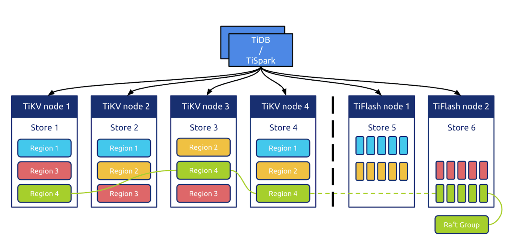

# TiFlash



[TiFlash](https://docs.pingcap.com/tidb/stable/tiflash-overview) is a columnar storage component of [TiDB](https://docs.pingcap.com/tidb/stable) and [TiDB Cloud](https://en.pingcap.com/tidb-cloud/), the fully-managed service of TiDB. It mainly plays the role of Analytical Processing (AP) in the Hybrid Transactional/Analytical Processing (HTAP) architecture of TiDB.

TiFlash stores data in columnar format and synchronizes data updates in real-time from [TiKV](https://github.com/tikv/tikv) by Raft logs with sub-second latency. Reads in TiFlash are guaranteed transactionally consistent with Snapshot Isolation level. TiFlash utilizes Massively Parallel Processing (MPP) computing architecture to accelerate the analytical workloads.

TiFlash repository is based on [ClickHouse](https://github.com/ClickHouse/ClickHouse). We appreciate the excellent work of the ClickHouse team.

## Quick Start

### Start with TiDB Cloud

Quickly explore TiFlash with [a free trial of TiDB Cloud](https://tidbcloud.com/signup).

See [TiDB Cloud Quick Start Guide](https://docs.pingcap.com/tidbcloud/tidb-cloud-quickstart).

### Start with TiDB

See [Quick Start with HTAP](https://docs.pingcap.com/tidb/stable/quick-start-with-htap) and [Use TiFlash](https://docs.pingcap.com/tidb/stable/use-tiflash).

## Build TiFlash

TiFlash supports building on the following hardware architectures:

- x86-64/amd64
- aarch64

And the following operating systems:

- Linux
- MacOS

### 1. Checkout Source Code

Assume `$WORKSPACE` to be the directory under which the TiFlash repo is placed.

```shell
cd $WORKSPACE
git clone https://github.com/pingcap/tiflash.git --recursive -j 20
```

### 2. Prepare Prerequisites

The following packages are needed for all platforms:

- CMake 3.21.0+

- Rust: Recommended to use [rustup](https://rustup.rs) to install:

  ```shell
  curl https://sh.rustup.rs -sSf | sh -s -- -y --profile minimal --default-toolchain nightly
  source $HOME/.cargo/env
  ```

- Python 3.0+

- Ninja or GNU Make

The following are platform-specific prerequisites. Click to expand details:

<details>
<summary><b>Linux specific prerequisites</b></summary>

TiFlash can be built using either LLVM or GCC toolchain on Linux. LLVM toolchain is our official one for releasing.

> But for GCC, only GCC 7.x is supported as far, and is not planned to be a long term support. So it may get broken some day, silently.

- LLVM 13.0.0+

  TiFlash compiles using full LLVM toolchain (`clang/compiler-rt/libc++/libc++abi`) by default. You can use a system-wise toolchain if `clang/compiler-rt/libc++/libc++abi` can be installed in your environment.

  Click sections below to see detailed instructions:

  <details>
  <summary><b>Set up LLVM via package managers in Debian/Ubuntu</b></summary>

  ```shell
  # add LLVM repo key
  wget -O - https://apt.llvm.org/llvm-snapshot.gpg.key|sudo apt-key add -

  # install LLVM packages, and can find more detailed instructions in https://apt.llvm.org/ when failed
  apt-get install clang-13 lldb-13 lld-13 clang-tools-13 clang-13-doc libclang-common-13-dev libclang-13-dev libclang1-13 clang-format-13 clangd-13 clang-tidy-13 libc++-13-dev libc++abi-13-dev libomp-13-dev llvm-13-dev libfuzzer-13-dev

  # install other dependencies
  apt-get install lcov cmake ninja-build libssl-dev zlib1g-dev libcurl4-openssl-dev
  ```

  </details>

  <details>
  <summary><b>Set up LLVM via package managers in Archlinux</b></summary>

  ```shell
  # install compilers and dependencies
  sudo pacman -S clang libc++ libc++abi compiler-rt openmp lcov cmake ninja curl openssl zlib
  ```

  </details>

- GCC 7.x

  > **WARNING**: This support may not be maintained in the future.

  TiFlash compiles on GCC 7.x (no older, nor newer) only because it hasn't been broken. If you have GCC 7.x, you are probably fine, for now.

</details>

<details>
  <summary><b>MacOS specific prerequisites</b></summary>

- Apple Clang 12.0.0+
- OpenSSL 1.1

  ```shell
  brew install openssl@1.1
  ```

</details>

### 3. Build

Assume `$BUILD` to be the directory under which you want to build TiFlash.

For Ninja:

```shell
cd $BUILD
cmake $WORKSPACE/tiflash -GNinja
ninja tiflash
```

For GNU Make:

```shell
cd $BUILD
cmake $WORKSPACE/tiflash
make tiflash -j
```

After building, you can get TiFlash binary under `$BUILD/dbms/src/Server/tiflash`.

### Build Options

TiFlash has several CMake build options to tweak for development purposes. These options SHOULD NOT be changed for production usage, as they may introduce unexpected build errors and unpredictable runtime behaviors.

To tweat options, pass one or multiple `-D...=...` args when invoking CMake, for example:

```shell
cmake $WORKSPACE/tiflash -DCMAKE_BUILD_TYPE=DEBUG
```

- **Build Type**:

  - `-DCMAKE_BUILD_TYPE=RELWITHDEBINFO`: Release build with debug info (default)

  - `-DCMAKE_BUILD_TYPE=DEBUG`: Debug build

  - `-DCMAKE_BUILD_TYPE=RELEASE`: Release build

- **Build with Unit Tests**:

  - `-DENABLE_TESTS=OFF`: Default

  - `-DENABLE_TESTS=ON`

- **Build with System Libraries**:

  <details>
  <summary>Click to expand instructions</summary>

  For local development, it is sometimes handy to use pre-installed third-party libraries in the system, rather than to compile them from sources of the bundled (internal) submodules.

  Options are supplied to control whether to use internal third-party libraries (bundled in TiFlash) or to try using the pre-installed system ones.

  > **WARNING**: It is NOT guaranteed that TiFlash would still build if any of the system libraries are used.
  > Build errors are very likely to happen, almost all the time.

  You can view these options along with their descriptions by running:

  ```shell
  cd $BUILD
  cmake -LH | grep "USE_INTERNAL" -A3
  ```

  All of these options are default as `ON`, as the names tell, using the internal libraries and build from sources.

  There is another option to append extra paths for CMake to find system libraries:

  - `PREBUILT_LIBS_ROOT`: Default as empty, can be specified with multiple values, seperated by `;`

  Specifically, for [TiFlash proxy](https://github.com/pingcap/tidb-engine-ext):

  - `USE_INTERNAL_TIFLASH_PROXY=TRUE` (default) / `FALSE`

    One may want to use external TiFlash proxy, e.g., if he is developing TiFlash proxy together with TiFlash, assume `$TIFLASH_PROXY_REPO` to be the path to the external TiFlash proxy repo

    Usually need to be combined with `PREBUILT_LIBS_ROOT=$TIFLASH_PROXY_REPO`, and `$TIFLASH_PROXY_REPO` should have the following directory structure:

    - Header files are under directory `$TIFLASH_PROXY_REPO/raftstore-proxy/ffi/src`

    - Built library is under directory `$TIFLASH_PROXY_REPO/target/release`

  </details>

## Run Unit Tests

To run unit tests, you need to build with `-DCMAKE_BUILD_TYPE=DEBUG`:

```shell
cd $BUILD
cmake $WORKSPACE/tiflash -GNinja -DCMAKE_BUILD_TYPE=DEBUG
ninja gtests_dbms       # Most TiFlash unit tests
ninja gtests_libdaemon  # Settings related tests
ninja gtests_libcommon
```

And the unit-test executables are at `$BUILD/dbms/gtests_dbms`, `$BUILD/libs/libdaemon/src/tests/gtests_libdaemon` and `$BUILD/libs/libcommon/src/tests/gtests_libcommon`.

## Run Sanitizer Tests

TiFlash supports testing with thread sanitizer and address sanitizer.

To generate unit test executables with sanitizer enabled:

```shell
cd $BUILD
cmake $WORKSPACE/tiflash -GNinja -DENABLE_TESTS=ON -DCMAKE_BUILD_TYPE=ASan # or TSan
ninja gtests_dbms
ninja gtests_libdaemon
ninja gtests_libcommon
```

There are known false positives reported from leak sanitizer (which is included in address sanitizer). To suppress these errors, set the following environment variables before running the executables:

```shell
LSAN_OPTIONS=suppressions=$WORKSPACE/tiflash/test/sanitize/asan.suppression
```

## Run Integration Tests

TBD.

## Generate LLVM Coverage Report

TBD.

## Contributing

Here is the overview of TiFlash architecture [The architecture of TiFlash's distributed storage engine and transaction layer](/docs/design/0000-00-00-architecture-of-distributed-storage-and-transaction.md).

See [TiFlash Development Guide](/docs/DEVELOPMENT.md) and [TiFlash Design documents](/docs/design).

Before submitting a pull request, please use [format-diff.py](format-diff.py) to format source code, otherwise CI build may raise error.

> **NOTE**: It is required to use clang-format 12.0.0+.

```shell
cd $WORKSPACE/tiflash
python3 format-diff.py --diff_from `git merge-base ${TARGET_REMOTE_BRANCH} HEAD`
```

## License

TiFlash is under the Apache 2.0 license. See the [LICENSE](./LICENSE) file for details.
