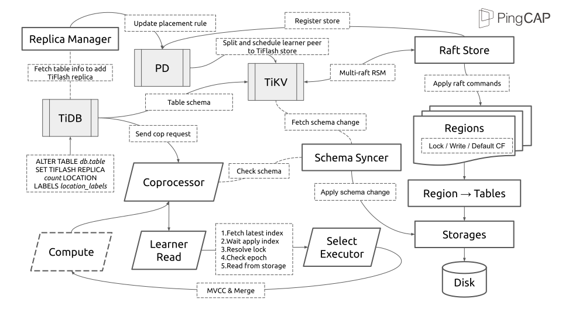
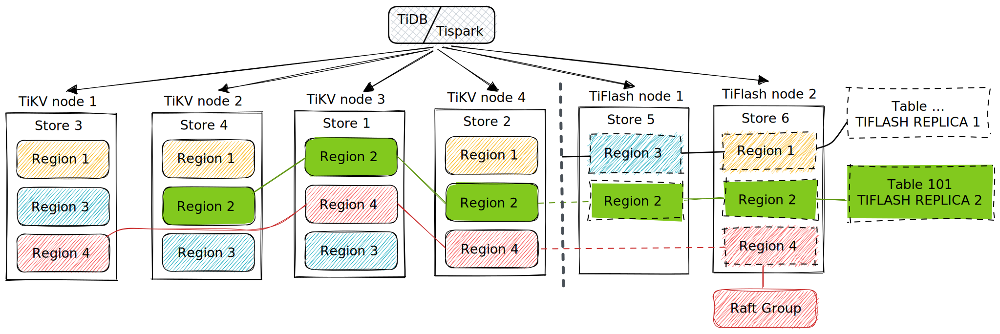
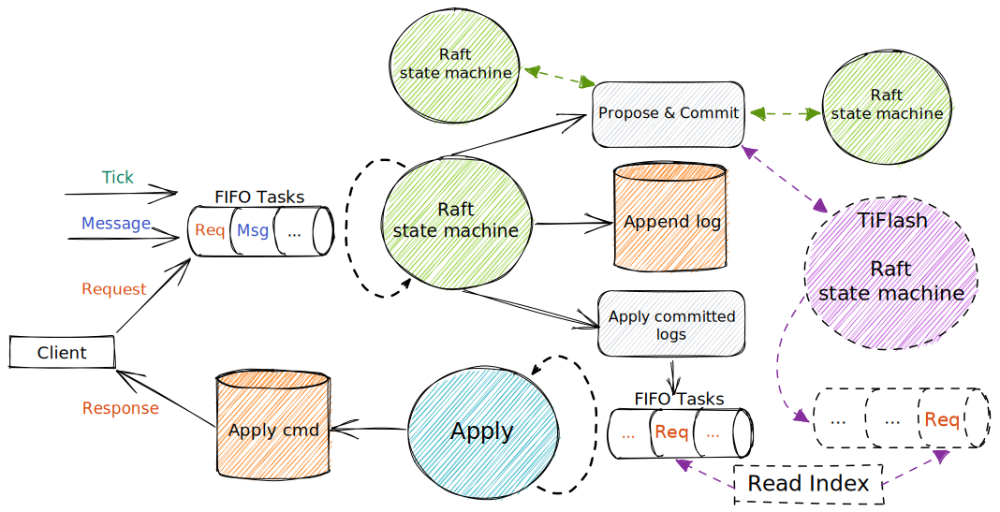

# Architecture Of Distributed Storage Engine And Transaction Layer

- Author(s): [Zhigao Tong](http://github.com/solotzg), [birdstorm](https://github.com/birdstorm), [Calvin Neo](https://github.com/CalvinNeo)

## Introduction

There is already a distributed `OLTP`(Online transaction processing) storage product [TiKV](https://github.com/tikv/tikv).
To make TiDB applicable to the `HTAP`(Hybrid transaction/analytical processing) scenario, we need a specialized analytical engine called `TiFlash`, to enhance the ability of real-time analytics.
Unlike other typical `OLAP`(Online analytical processing) databases which only guarantee `Eventual Consistency`, TiFlash is built on the same distributed infrastructure(`Multi-raft RSM`, `Percolator Transaction Model`) like TiKV.
TiFlash is designed to provide `Strong Consistency` read services.
It means any other component, like TiDB or TiSpark, can access TiFlash and TiKV by the same protocol, which ensures consistency is snapshot read.

## Design

### Overview

After one TiFlash node is deployed into the TiDB cluster, it will register necessary properties(labels with `engine`:`tiflash`, address, runtime information, etc.) to [Placement driver](https://github.com/tikv/pd)(hereafter referred to as `PD`) as a `raft store`.

PD will not schedule any region peer to TiFlash store if there is no [Placement Rules](https://docs.pingcap.com/tidb/stable/configure-placement-rules) related to TiFlash.
After TiDB has executed the `DDL` job, which tries to set `TIFLASH REPLICA` for the specific table, the `Replica Manager` module will translate related jobs into `Placement Rules` and update them to PD.
Then, PD will try to split and schedule `Learner` peer of related regions to TiFlash store by corresponding rules.

All peers of the same region make up a `Raft Group`.
The group represents a `Replicated State Machine`(RSM).
The `Leader` replicates actions to the followers and learners.
Each peer maintains a `Durable Write-ahead Log`(DWAL).
All peers append each action as an entry in the log immediately as they receive it.
When the quorum (the majority) of peers have confirmed that the entry exists in their log, the leader commits. Each peer then can apply the action to their state machine.
TiFlash relies on the [TiDB Engine Extensions Library](https://github.com/pingcap/tidb-engine-ext)(works as `Raft Store` dynamic library) to maintain multi-raft RSM.
A `TIFLASH REPLICA` of the table is an abstract concept that can be regarded as a collection of multiple learner peers(region range of peer intersects with the record data range of the table) in the TiFlash store.

A database transaction, by definition, must be atomic, consistent, isolated, and durable.
Transaction writing proposed by TiDB must follow the `Percolator Model`.
The key-value engine of TiKV provides a feature named `Column Family`(hereafter referred to as CF).
The three CFs: `DEFAULT`, `LOCK` and `WRITE`, correspond to Percolator's `data column`, `lock column` and `write column`, respectively.
TiFlash builds abstract layers of `Region` from `Raft Store` and applies raft commands with writing operations towards these CFs.
TiFlash fetches `Table Schema`(generated by TiDB) from TiKV and tries to write the committed records into strong schema-aware column storage.

`Transaction Read Protocol`(like coprocessor or MPP) is the basic protocol used to read table data or execute sub-tasks in `raft store`.
`Region Peer` is the minimal unit for transaction reading.
To guarantee `Snapshot Isolation`, there are a few essential safeguard mechanisms:

- `Replica Read` ensures that the raft state machine of region peer is correct and has enough context.
- `Resolve Lock` checks whether related table records are locked and tries to resolve them.
- `MVCC(Multiversion concurrency control)` read table records by specific version(`Timestamp`, hereafter referred to as ts) provided by PD.

### Distributed Storage Framework

[TiDB Engine Extensions Library](https://github.com/pingcap/tidb-engine-ext)(hereafter referred to as `raftstore-proxy` or `tiflash-proxy`) is a TiKV based `c dynamic library` for extending storage system in `TiDB` cluster.
This library aims to export the current multi-raft framework to other engines and make them able to provide services(read/write) as `raft store` directly.

Generally speaking, there are two storage components in TiKV for maintaining multi-raft RSM: `RaftEngine` and `KvEngine`.
KvEngine is mainly used for applying raft command and providing key-value services.
RaftEngine will parse its own committed raft log into corresponding normal/admin raft commands, which will be handled by the apply process.
Multiple modifications about region data/meta/apply-state will be encapsulated into one `Write Batch` and written into KvEngine atomically.
It is an option to replace KvEngine with `Engine Traits`.
But it's not easy to guarantee atomicity while writing/reading dynamic key-value pair(such as meta/apply-state) and patterned data(strong schema) together for other storage systems.
Besides, a few modules and components(like importer or lighting) reply on the SST format of KvEngine in TiKV.
It may cost a lot to achieve such a replacement.

It's suggested to let the apply process work as usual but only persist meta and state information to bring a few intrusive modifications against the original logic of TiKV.
i.e., we must replace everywhere that may write normal region data with related interfaces.
Unlike KvEngine, the storage system(called `engine-store`) under such a framework should be aware of the transition about multi-raft RSM from these interfaces.
The `engine-store` must have the ability to deal with raft commands to handle queries with region epoch.

The `region snapshot` presents the complete region information(data/meta/apply-state) at a specific apply-state.

Anyway, because there are at least two asynchronous runtimes in one program, the best practice of such raft store is to guarantee `External Consistency` by `region snapshot`.
The raft logs persisted in RaftEngine are the `WAL(Write-ahead Log)` of the apply process.
Index of raft entry within the same region peer is monotonic increasing.
If the process is interrupted at the middle step, it should replay from the last persisted apply-state after the restart.
Until a safe point is reached, related modifications are not visible to others.

`Idempotency` is an essential property for `External Consistency`, which means such a system could handle outdated raft commands. A practical way is like:

- Fsync snapshot in `engine-store` atomically
- Fsync region snapshot in `raftstore-proxy` atomically
- Make RaftEngine only GC raft log whose index is smaller than persisted apply-state
- `engine-store` should screen out raft commands with outdated apply-state during apply process
- `engine-store` should recover from the middle step by overwriting and must NOT provide services until caught up with the latest state

Such architecture inherited several important features from TiKV, such as distributed fault tolerance/recovery, automatic re-balancing, etc.
It's also convenient for PD to maintain this kind of storage system by the existing way as long as it works as `raft store`.

#### Interfaces

Since the program language `Rust`, which TiKV uses, has zero-cost abstractions, it's straightforward to let different threads interact with each other by `FFI`(Foreign Function Interface).
Such mode brings almost no overhead.
However, any caller must be pretty clear about the exact safe/unsafe operations boundary.
The structure used by different runtimes through interfaces must have the same memory layout.

It's feasible to refactor TiKV source code and extract parts of the necessary process into interfaces. The main categories are like:

- applying normal-write raft command
- applying admin raft command
- peer detection: destroy peer
- region snapshot: pre-handle/apply region snapshot
- SST file reader
- applying `IngestSst` command
- replica read: batch read-index
- encryption: get file; new file; delete file; link file; rename file;
- status services: metrics; CPU profile; config; thread stats; self-defined API;
- store stats: key/bytes R/W stats; disk stats; `engine-store` stats;
- tools/utils

TiKV can split or merge regions to make the partitions more flexible.
When the size of a region exceeds the limit, it will split into two or more regions, and its range would change from `[a, c)` to `[a, b)` and `[b, c)`.
When the sizes of two consecutive regions are small enough, TiKV will merge them into one, and their range would change from `[a, b)` and `[b, c)` to `[a, c)`.

We must persist the region snapshot when executing admin raft commands about `split`, `merge` or `change peer` because such commands will change the core properties(`version`, `conf version`, `start/end key`) of multi-raft RSM.
Ignorable admin command `CompactLog` may trigger raft log GC in `RaftEngine`.
Thus, to execute such commands, it's required to persist region snapshot.
But while executing normal-write command, which won't change region meta, the decision of persisting can be pushed down to `engine-store`.

When the region in the current store is illegal or pending removal, it will execute a `destroy-peer` task to clean useless data.

According to the basic transaction log replication, a leader peer must commit or apply each writing action before returning success ACK to the client.
When any peer tries to respond to queries, it should get the latest committed index from the leader and wait until the apply-state caught up to ensure it has enough context.
For learners/followers or even leaders, the `Read Index` is a practical choice to check the latest `Lease` because it's easy to make any peer of region group provide read service under the same logic as the overhead of read-index itself is insignificant.

When the leader peer has reclaimed related raft log or other peers can not proceed with RSM in the current context, other peers can request a region snapshot from the leader.
However, the region snapshot data, whose format is TiKV's `SST` file, is not usually used by other storage systems directly.
The standard process has been divided into several parts to accelerate the speed of applying region snapshot data:

- `SST File Reader` to read key-value one by one from SST files
- Multi-thread pool to pre-handle SST files into the self-defined structure of `engine-store`
- Delete old data within [start-key, end-key) of the new region strictly.
- Apply self-defined structure by original sequence

Interfaces about `IngestSst` are the core to be compatible with `TiDB Lighting` and `BR` for the `HTAP` scenario.
It can substantially speed up data loading/restoring.
`SST File Reader` is also useful when applying the `IngestSst` raft command.

Encryption is essential for `DBaaS`(database as a service).
To be compatible with TiKV, a data key manager with the same logic is indispensable, especially for rotating data encryption keys or using the KMS service.

Status services like metrics, CPU/Memory profile(flame graph), or other self-defined stats can effectively support the diagnosis.
It's suggested to encapsulate those into one status server and let other external components visit through the status address.
We could also reuse most of the original metrics of TiKV, and an optional way is to add a specific prefix for each name.

When maintaining DWAL, it's practical to batch raft msg before fsync as long as latency is tolerable to reduce IOPS(mainly in RaftEngine) and make it system-friendly with poor performance.

### Transaction

Basic synopsis: [TiDB Transaction](https://pingcap.github.io/tidb-dev-guide/understand-tidb/transaction.html), [Optimized Percolator](https://tikv.org/deep-dive/distributed-transaction/optimized-percolator)

#### Multi-raft RSM

To provide services as a `raft store` directly, TiFlash must implement all interfaces provided by raftstore-proxy.
There are two kinds of raft command: `normal-write`, `admin`.

**normal-write command** consists of [cmd types](https://tikv.github.io/doc/kvproto/raft_cmdpb/enum.CmdType.html) and key-value pairs towards CFs.
For now, except cmd type `Put`, `Delete`, `DeleteRange` or `IngestSst`, others are useless.

- `DeleteRange` is ignorable because such type only appears when the table is dropped safely(exceed GC safe time), but TiFlash has its own table GC strategy to clean data directly.
- `Put` means replace into a key-value
- `Delete` means delete key-value by key
- `IngestSst` means ingest several TiKV SST files of DEFAULT/WRITE CFs.

The content of each CF:

- `DEFAULT`: `(key, start_ts)` -> `value`
- `LOCK`: `key` -> `lock_info(lock_type, primary_lock, lock_version, ...)`
- `WRITE`: `(key, commit_ts)` -> `write_info(write_type, start_ts, [short_value], ...)`

In the concept of `Snapshot Isolation`, all deletion operations proposed by the transaction process are logical, which means `Put` a key-value with write_type `D`(delete).
While the whole transaction process is quite complex, TiFlash only deals with the transaction read by now, and thus write_types except `P`(Put) and `D`(Delete) along with others such as `L`(Lock) and `R`(Rollback) can be ignored safely.
TiFlash will find committed data(legal values in WRITE CF) and transform related messages into complete table records by its schema.

**admin command** is one of [AdminCmdType](https://tikv.github.io/doc/kvproto/raft_cmdpb/enum.AdminCmdType.html).
In most FFI functions, raftstore-proxy will provide the apply result(including region meta) as a parameter.
TiFlash can use such parameters to maintain RSM directly.
We also designed another mechanism to reduce the frequency of executing the `CompactLog` command, which takes the timeout, write-throughput, size, etc., into account to minimize IOPS and flush table records into column storage by large batch(friendly for column storage).

##### Region Snapshot

Unlike TiKV, which uses [RocksDB](https://github.com/tikv/rocksdb) as KvEngine directly, TiFlash can maintain multi-raft RSM in several parts:

- RSM in raftstore-proxy
  - Build real RSM like TiKV without adding actual info in data CFs.
  - Communicate with other components as a `raft store`.
  - Expose region meta, data, and other necessary info to TiFlash.
- RSM in TiFlash
  - Maintain RSM through interfaces from raftstore-proxy.
  - Persist whole region cache in memory by apply-state as `region snapshot` atomically.
- Committed table records in column storage
  - Store committed transaction data by a strong schema.
  - Support MVCC by ts.
  - Support table data GC.

Redundancy is a practical way to guarantee `Idempotency` and `External Consistency`, which means updating region meta should be lazy while adding data but advanced while removing the region.

Persisting the whole region cache as a snapshot can help avoid using `WAL` but might bring more overhead when there are lots of uncommitted data.
It may happen if somehow a quite large transaction is blocked for a long time.
But for most normal scenarios, the transaction will be committed or rollbacked quickly, which means the frequent operations towards LOCK/DEFAULT won't cause excessive remained data in memory.

A possible solution is implementing incremental store mode, which uses another key-value storage or other semi-structured engines as intermediate buffers.

#### Learner Read

A learner does not participate in leader elections, nor is it part of a quorum for log replication.
Log replication from the leader to a learner is asynchronous.
The strong consistency between the leader and the learner is enforced during the read time.

After the feature [Async Commit](https://pingcap.github.io/tidb-dev-guide/understand-tidb/async-commit.html) and [1PC](https://pingcap.github.io/tidb-dev-guide/understand-tidb/1pc.html), `Read Index` request should contain start-ts of transaction read to resolve memory locks of leader peer in TiKV.
After the current region peer has applied to the latest committed index, it's available to check table locks(like TiKV does) and try to resolve them.

Epoch(`version`, `conf version`) is one of the important properties to present region meta changing.
The latest `GC Safepoint` should always be smaller than start-ts of transaction read.
We shall double-check both of them even after getting immutable snapshot information from storage.

The logic about **Resolve Lock** is complex.
Related behaviors should follow the established process(like TiDB does) in different [Clients](https://github.com/tikv?q=client&type=all).
This document will not discuss the details herein.

## Notice

To understand the architecture shown above, please refer to those first:

- Source code about raftstore, rocksdb, transaction modules in [TiKV](https://github.com/tikv/tikv)
- Source code about DDL, transaction modules in [TiDB](https://github.com/pingcap/tidb)
- `Placement Rules`, scheduler modules in [PD](https://github.com/tikv/pd)
