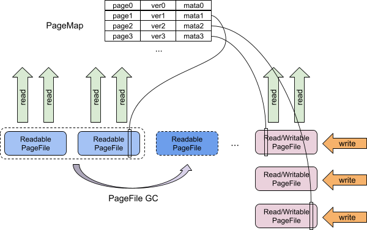

# Architecture Of Storage Engine - PageStorage

- Authors(order by last name): [JaySon-Huang](https://github.com/JaySon-Huang), [flowbehappy](https://github.com/flowbehappy), [Jiaqi Zhou](https://github.com/jiaqizho)

## Introduction

PageStorage is one of the earliest components used in delta merge storage. In the early days of the TIFlash, PageStorage was used as the basic storage moudle, All of IO from DT will store into PageStorage. Over time, we only place elements of `delta` and `metadata of DT` in PageStorage.

PageStorage needs to handle a large amount of delta data read and write, this part of the data is hot data. And a small amount of DT meta information needs to be persisted, this part is cold data. The data of delta  will eventually be merged into the stable part, eq. stored in the DT file.

You can see the picture below. Described in the picture is the design of the entire DT. PageStorage carries the traffic of the upper half of DT.

As one of the important components of DMS, PageStorage mainly provides a KV storage service which also support MVCC. Unlike other KV services, the KV interface provided by PageStorage is limited. Key is limited to uint64_t, Value is limited to a buffer or a array of buffer(we called it fields) or null.

## Capability

PageStorage supported: 

- Disk-based store
- Write/Read operation atomicity
- Full MVCC function 
- KV store function
- GC

## Design

Currently there are three versions of PageStorage (V1, V2, V3). The V1 version is no longer used by DT. Due to compatibility considerations, it's still used in some components, we considered to remove it the future. It won't be covered too much in this article.

At present, most of our customers use the V2 version, which is also the version with the longest service time. Due to design issues, the V2 version has some problems that cannot be improved(will be introduced below), so we propose the V3 version.

The V3 version has been proposed for a period of time, and it was officially used by customers in TiFlash v6.1.0. This version has improved the shortcomings of V2 very well. The redesign has made the module very good in terms of performance and maturity. 

### 1. V2 version

The picture below describes the design in PageStorage V2.
We provider a big PageMap which stored data and meta of pages. Also provider Writable/Readable pagefile to support write/read of page.

Here is the basic elements in PageStorage V2:

- WriteBatch: a batch of write
   - upper layer used this struct to write a batch of buffer into PageStorage.
- Page: basic data elements
   - it contains id, buffer, fields...
   - A set of pages will as return value when upper layer read by a set of page id.
- PageFile: contains meta and data
   - data: buffer will store into the this part
   - meta: used to manager the data part record every data of page.
- PageFileReader: used to read a single pagefile.
- PageFileWriter: used to write a single pagefile.
- PageEntriesVersionSetWithDelta: The MVCC object

#### meta and data

Pagefile is a directory on the filesystem which is named with type_id_level. For example page_55_1, “page” means that pagefile type is “formal”, “55” is the pagefile id, “1” is the level.

Pagefile is composed of multiple meta buffers and multiple data buffers. Meta buffer keep the pagefile meta info,  it contains multiple write batch buffer. 

Here is the meta sturct:

Bits                | Name             | Description.          |
--------------------|------------------|-----------------------|
0:32                | Meta Byte Size   | The buffer length     |
32:64               | version          | The page format version, should be V1 or V2 |
64:128               | SequenceID          | The ID of sequence | 
128:N               | Buffer list          | Collection of meta buffer, length is flexible | 
N:+64               | Checksum          | Checksum | 

A write batch can contain a sequence of operations(put/upsert/del/ref), so a buffer list is a flexible list to record that. 

buffer list(operate:put/upsert)

Bits                | Name             | Description.          |
--------------------|------------------|-----------------------|
0:8                 | Write Type       | Write batch operation type |
8:72                | Page ID          | The page Id           |
72:136              | File ID          | The pagefile Id       |
136:168             | Level            | The page level        |
168:200             | Flag             | The page Flag decide page detach or not       |
200:264             | Page offset      | The page offset which record data offset in current pagefile |
264:328             | Page size        | The page size which record data size        |
328:392             | Page checksum    | The page checksum        |
392:456             | Field offsets length    | The length of field offset      |

buffer list(operate:del)

Bits                | Name             | Description.          |
--------------------|------------------|-----------------------|
0:8                 | Write Type       | Write batch operation type |
8:72                | Page ID  		  | The page Id           |

buffer list(op:ref)

Bits                | Name             | Description.          |
--------------------|------------------|-----------------------|
0:8                 | Write Type       | Write batch operation type |
8:72                | Page ID  		  | The page Id           |
72:136              | Origin Page ID   | The Origin page id    |

Field offsets 

Bits                | Name             | Description.          |
--------------------|------------------|-----------------------|
0:64                | Field Offset       | The field offset |
64:128              | Field Checksum | The field checksum |

The data part is more simple, it have not contain any of meta info, it only consists of buffer.

Both of data and meta, we used append write + sync IO to write the file, data clean will be done by GC part. Also the file size of both is limited. If the data is larger than 128M(default), a new file will be automatically generated.

#### MVCC

`PageEntriesVersionSetWithDelta` is the main class of the MVCC, It's a big list, collect all version of page entries(it's a extension of Page object), The entries contain with every single page. Once snapshot created, the list will add a new version of page entries.

The API from PageStorage have a method named `getSnapshot()`. After call this method, MVCC will generate a snapshot which record all of page entries(in memory) in current time.

Then every read API from PageStorage request the snapshot as one of the parameters.But by default, the snapshot can be nullptr, then we will create a new snapshot for it.

In read method, PageStorage will use snapshot + page ids to find the page entries. After we got the entries, we will read the data buffer from pagefile and combine it to a set of page, Then return to the caller.

Also anytime there is a del operation come, we will not immediately mark the data on the disk to be cleaned up. Instead GC part will do the clean job.

#### GC

GC relative the snapshots release. If none of the snapshots in memory are released, then the GC will not clean up any data. In general, snapshots are released every once in a while, This will generate a lot of "expired" data on disk.

At each round of GC, the GC thread scans each pagefiles and calculates the valid rate of the pagefile through MVCC. valid rate equal to total valid size divide by total file size, If valid rate lower than 0.5(by default), we will do the compact GC. 

The compact GC will compact the valid page into a new pagefile. This process is in order not to generate spatial magnification.But the same, it will produce write amplification.

During the GC process, we do not lock the entire PageStorage, but use more fine-grained locks to ensure that the current PageStorage can respond to read and write.

#### write/read example

After write request come:

- Get a idle PageFileWriter(which is not locked), and locked it to avoid anther thread write. 
- Generate the meta record.
- Write buffer into the disk.
- Write the meta record into meta.

After read request come:

- Get a snapshot from caller or create a snapshot.
- Find the entries from the MVCC by snapshot + page ids.
- Using entries, read from disk.
- Combine the buffer and entries into pages and then return to the caller.

