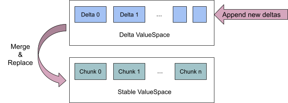
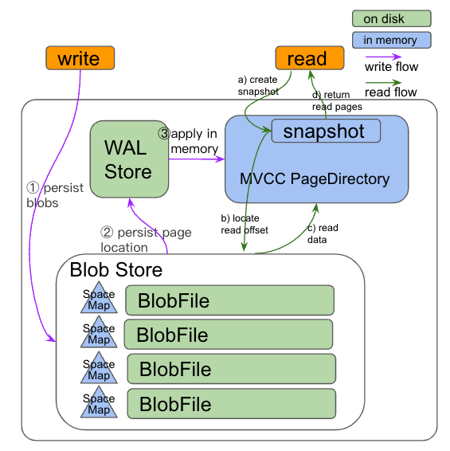
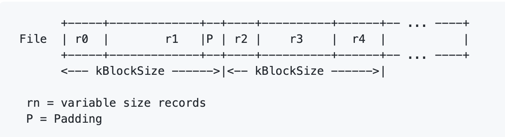

# Architecture Of Storage Engine - PageStorage

- Authors (order by last name): [JaySon-Huang](https://github.com/JaySon-Huang), [flowbehappy](https://github.com/flowbehappy), [Jiaqi Zhou](https://github.com/jiaqizho)
- Editorial reviewer: [shichun-0415](https://github.com/shichun-0415)

## Introduction

`PageStorage` is where Delta Tree (DT) engine actually stores data. The latest data (i.e. delta data), and the metadata in the engine are serialized into Pages. The main data (i.e. stable data), is written in DTFiles format and managed as `ExternalPage`s in PageStorage.

The following figure describes the "Delta ValueSpace" and "Stable ValueSpace" of DT. The data in "Delta ValueSpace" is continuously updated. After `delta merge` occurs, the delta data in PageStorage will be read and compacted into the "Stable ValueSpace".



As one of the important components of DT, PageStorage mainly provides a KV storage service that also supports MVCC. Unlike other KV services, the KV interface provided by PageStorage is limited. Specifically, Key is limited to uint64_t, and Value is limited to a buffer or an array of buffers (also called fields) or null.
## Capability

PageStorage supports: 

- Disk-based store
- Write/Read operation atomicity
- Full MVCC function 
- KV store function
- GC
## Background

Currently, there are three versions of PageStorage (V1, V2, V3). This document does not cover the details of the V1/V2 versions. The V3 version is recommended because the V2 design and implementation might lead to high write amplification and CPU usage in some scenarios.


The following are problems of V2 in a production environment:

- **There is a risk of data loss in the meta part**. As long as the `checksum` and `buffer size` fields in a single meta buffer are damaged at the same time, the subsequent buffers will be unavailable. This situation may occur upon a disk failure or the meta part is changed by an unexpected operation.
- **The snapshot of MVCC needs to be optimized**. First, the CPU usage occupied by the snapshot should be reduced. Second, the implementation of the MVCC structure is too complex to be understood and maintained.
- **The GC write amplification in the data part is high and the GC task is too heavy**. Because the data part is composed of append write, `compact gc` is frequently triggered. Besides, the meta part is bound to a data part by "PageFile", meaning that we have to apply `compact gc` to compact the small data in the meta part. `compact gc` means that PageStorage needs to read all the valid data from the disk, then rewrite the data into a new file. Each round of GC brings additional read and write overhead.

Besides resolving the preceding problems of V2, the V3 version also optimized the `lock` and `CRC` implementation.

## Design



The V3 version of PageStorage is composed of three main components, `PageDirectory`, `WALStore`, and `BlobStore`.

- BlobStore: provides space management by using address multiplexing to manage the data part.
- PageDirectory: provides the function of MVCC. It features smaller memory usage and faster speed than V2.
- WALStore (Write Ahead Log Store): uses the write-ahead log file format to manage the meta part.

### BlobStore

BlobStore mainly stores blob data. BlobStore consists of three parts:

- **BlobFile**: The file that stores blob data.
- **BlobStat**: A space manager used to find/allocate/free space in BlobFile. It has one-to-one mapping with the BlobFile.
- **BlobStats**: Manage all BlobStat. It is used to schedule all write requests.

Instead of storing data with append write, BlobStore uses a data structure called SpaceMap to manage the free space and perform random write in BlobFile.


The design is inspired by [Space Maps in Ext4 filesystem](https://www.kernel.org/doc/ols/2010/ols2010-pages-121-132.pdf). Each node in RB-tree has a space that is represented by (offset, size). The difference is that bitmap uses a node to record used locations, but BlobStore uses a node to record free locations. Recording free locations is a better way to find a free space by the data size.

`BlobStat` is represented by a SpaceMap to reuse the space after being reclaimed, thereby reducing write amplification. 

In order to avoid getting some simple statistics by traversing the full SpaceMap, BlobStat provides external statistical status, such as the valid rate of the current BlobFile, the maximum capacity, and so on. These statistics are useful for:

1. BlobStats can determine whether to create a new Blobfile or reuse the old one.
2. BlobStats choose the lowest valid rate among all BlobFile to reuse the reclaimed space whenever possible, avoid creating new BlobFiles
3. GC routine can use these statistics to quickly determine whether the current BlobFile needs to perform `compact GC` to avoid severe space amplification
4. GC routine can perform truncate to free the spaces at the end of BlobFiles on disk. Reducing space amplification 

What's more, when a write request happens, BlobStore will ask BlobStats for unused space from BlobStats. Since all disk spaces are scheduled by BlobStats and happen in memory, once the location is allocated from BlobStats, all actual write operations to the disk can be parallelized. So BlobStore allows maximum IO parallelism to utilise disk bandwidth.


### PageDirectory

PageDirectory supports the function of MVCC, providing a read-only snapshot that does not block writes. It is mainly composed of an RB-tree map with the key is `page id` and the value is the `version chain`.

The `version chain` is another RB-tree map with key `PageVersion` and value `PageEntry`. `PageEntry` represents the location of the data in `BlobStore` and is sorted by `PageVersion`(`<sequence, epoch>`) in the `version chain`. `PageVersion` is used for filtering by a read-only snapshot. PageDirectory will increase the `sequence` in serial when applying WriteBatches. The page entries created in the same WriteBatch use the same `sequence`, and the epoch is initialized to 0. After we applied "full GC" that moves the data into another location, we will create page entries with the same sequence but the epoch is last epoch + 1.

Creating a snapshot for PageStorage is simply atomically getting the `sequence id` from PageDirectory. And the `sequence id` in the snapshot will be used to filter the result and provide an immutable result from PageDirectory. PageDirectory always return the latest entry version that is less than `sequence id + 1`.

Here is a example:

```
page id 1 : {[(seq 1, epoch 0), entry 1], [(seq 2, epoch 0), entry 2], [(seq 3, epoch 1), entry 3]}
page id 2 : {[(seq 1, epoch 0), entry 4], [(seq 2, epoch 0), entry 5], [(seq 5, epoch 0), entry 6]}
page id 100 : {[(seq 1, epoch 0), entry 7], [(seq 10, epoch 2), entry 8]}
```

In this example, PageDirectory have 3 page with different id. Page 1 has 3 different versions corresponding to 3 entries. page 100 has 2 different versions corresponding to 2 entries. If caller get a entry for page id 2 with a snapshot that sequence is 2, PageDirectory will return the entry 5.


### WALStore

WALStore provides two main interfaces:

- **apply**: After `apply`, the WriteBatch info will be atomicity serialized on disks. This happens after writing data to BlobStore.
- **read**: Read serialized meta info from disks. This will happen when `PageStorage` is being restored.

In order to control the time of restoring WriteBatches and reconstruct the PageDirectory while startups, PageDirectory will dump its snapshot into WALStore and clear the old log files by the snapshot.

#### File format


WALStore builds upon its serialized write batches (the meta part) base on log file format. The log file format is similar to the log file format as rocksdb [Write Ahead Log File Format](https://github.com/facebook/rocksdb/wiki/Write-Ahead-Log-File-Format#log-file-format).

This log file format is convenient to detect disk failure. If a disk failure happens, we can stop TiFlash from startup and returning wrong results. In the worst case when CRC and the length of a meta record are broken at the same time, we can try to discard the broken data by the fixed-length block, other blocks can be preserved and try to recover some data.

WALStore serializes the WriteBatch into an atomic record and writes it to the log file upon on "log file format". As the log file reader ensure we can get a complete record from the log file format, we don't need to serialize the byte length of the WriteBatch into record. The serialize structure of WriteBatch:

buffer(WriteBatch)
Bits                | Name              | Description.          |
--------------------|-------------------|-----------------------|
0:32                | WriteBatch version| Write batch version   |
32:N                | Operations        | A series of operations|

buffer(operate:put)

Bits                | Name             | Description.          |
--------------------|------------------|-----------------------|
0:8                 | Write Type       | Write batch operation type |
8:16                | Flag             | A preserved flag           |
16:144              | Page Id          | The combine of namespace id and page id       |
144:272             | Version          | The combine of sequence and epoch             |
272:336             | Ref count        | The page being ref count  |
272:N               | Page entry       | The page entry            |

Page entry

Bits                | Name             | Description.          |
--------------------|------------------|-----------------------|
0:32                | Blob File id     | The Blob File Id |
32:96               | Offset           | The Page Entry offset |
96:160              | Size             | The Page Entry size |
160:224             | Checksum         | The Page Entry checksum |
224:288             | Tag         	   | The Page tag |
288:352             | Field offsets length    | The length of field offset      |
352:N               | Field offsets    | The length field offsets      |

Field offsets 

Bits                | Name             | Description.          |
--------------------|------------------|-----------------------|
0:64                | Field Offset     | The field offset |
64:128              | Field Checksum   | The field checksum |

buffer(operate:ref)

Bits                | Name             | Description.          |
--------------------|------------------|-----------------------|
0:8                 | Write Type       | Write batch operation type |
8:132               | Page Id          | The combine of namespace id and page id       |
132:260             | Origin Page Id   | The combine of namespace id and page id       |
260:388             | Version          | The combine of sequence and epoch             |

buffer(operate:put_ext)

Bits                | Name             | Description.          |
--------------------|------------------|-----------------------|
0:8                 | Write Type       | Write batch operation type |
8:132               | Page Id          | The combine of namespace id and page id       |
132:260             | Version          | The combine of sequence and epoch             |
260:324             | Ref count        | The page being ref count  |

buffer(operate:del)

Bits                | Name             | Description.          |
--------------------|------------------|-----------------------|
0:8                 | Write Type       | Write batch operation type |
8:132               | Page Id          | The combine of namespace id and page id       |
132:260             | Version          | The combine of sequence and epoch             |


### The GC routine of PageStorage

In the beginning, in order to control the time of restoring WriteBatches and reconstructing the PageDirectory while startups, PageStorage needs to apply GC on WALStore. When the log files of WALStore reach a certain number, PageDirectory will serialize the latest version of entries and dump the entries as a record into a new log file. After that, the log files generated before the PageDirectory snapshot (except the log file is being written) will be removed. Usually, this part is lightweight since we traverse the PageDirectory will small lock granularity. And the PageDirectory's snapshot size dumped to disk is relatively small.

After that, PageStorage applies GC on PageDirectory. It will clean up the expired snapshot and expired page entries. Those expired page entries will be marked as removed from BlobStore. All related space maps in BlobStore will be updated.

After the space maps are updated, BlobStore will check all BlobStat to find out whether there are BlobFiles with a low valid rate. In order to reduce the space amplification brought by those low valid rate BlobFiles, PageStorage will perform "full GC" on those BlobFiles. The full GC will copy the valid data to the new BlobFile(s).

If "full GC" does happen in BlobStore, then BlobStore informs PageDirectory that some pages have been migrated and where are the new locations of those pages. PageDirectory applies the changes from BlobStore.

In practice, the probability of BlobStore triggering "full GC" is very low, which means that we will not generate too many read and write IO during the GC process.
