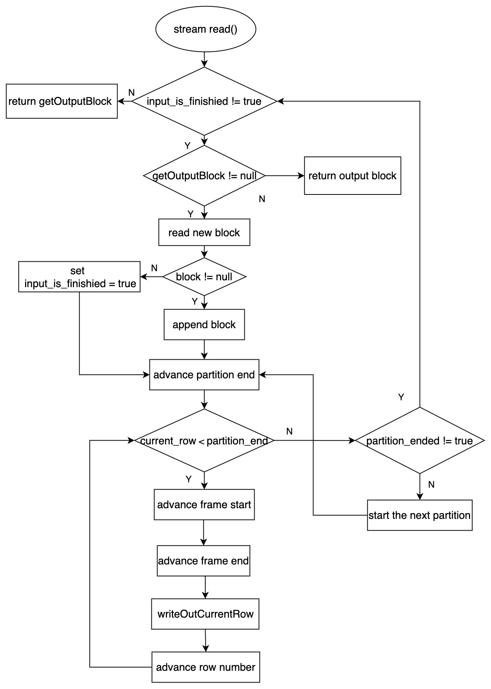

# Window Function
- Author(s): [mengxin9014](http://github.com/mengxin9014), [LittleFall](http://github.com/LittleFall)

## Introduction
Now more and more customers who use TiDB need to use window function, but TiDB does not support pushing down window function to TiFlash for execution, so once the customer's query has window function, it will prevent the subsequent expression from being pushed down to TiFlash, and TiDB Only one node can be used to process the window function, which will make the query with the window function less efficient and cannot effectively scale the cluster horizontally to improve the execution speed. Therefore, we need to support window function in TiFlash, so that the query with window function can be effectively pushed down to TiFlash.

## Design

### Syntax
The syntax is almost the same as mysql
```
{window_desc} over_clause
over_clause:
    {OVER (window_spec) | OVER window_name}
window_spec:
    [window_name] [partition_clause] [order_clause] [frame_clause]
partition_clause:
    PARTITION BY expr [, expr] ...
order_clause:
    ORDER BY expr [ASC|DESC] [, expr [ASC|DESC]] ...
}
```

###  Window Function Plan In MPP
Each Window Spec has three properties: PartitionBy, OrderBy, Frame;
- OrderBy is equal to PartitionBy + original OrderBy by default, because it needs to be sorted by PartitionBy attribute after dividing nodes.
#### Window Function Grouping
The PlanBuilder stage will group the windows by Window Spec (ie Partition By, Order By, Frame). Those with the same Window Spec will be put into the same Window operator for execution.
- Some functions may have specific requirements for Frame, such as row_number, etc., which will modify their own window spec and delete the frame attribute.
- Sort in window function is added by calling enforceProperty in enumeratePhysicalPlans4Task of Window. Window with the same Order By property can reuse the same Sort.
#### Partition
First, add Exchange and assign it to different nodes according to the Hash value of Partition By.
- When exhuast PhysicalWindow, childrenProperty is required to be of hash type and hash column to be PartitionBy column. When the pair needs to be executed as an MPP Task between multiple nodes.
- If there is no partitionBy clause, which means that all data is to be aggregated on the same node, the property is of type Single Partition.
#### sort
Then you need to push down Sort. Note that this Sort is sorted within a single node (hereinafter referred to as Partial Sort); and tiflash currently only supports this sort, not regular sorting.
- In order to safely distinguish Partial Sort and Sort, add a property SortItemsForPartition in the PhysicalProperty; and set both SortItems and SortItemsForPartition to the OrderBy column of Window when exhaust PhysicalWindow.
- When calling enforceProperty in enumeratePhysicalPlans4Task to generate Sort, MppTask will check whether the current property satisfies SortItems==SortItemsForPartition, and can add sort only if it is satisfied.
#### Push-Down Control
Add a push-down control list and connect to enforce_mpp, and return warnings when the push-down is blocked
Support WindowFuncDes in push-down blacklist.

#### Example
```sql=
explain select *, 
        max(salary) over (), 
        row_number() over w_deptid_salary, 
        max(salary) over w_deptid_salary,
        avg(salary) over w_deptid_salary_3,
        rank() over w_deptid_empid,
        row_number() over w_salarymod_deptid,
        count(empid) over w_salarymod_deptid
from employee
window w_deptid_salary as (partition by deptid order by salary),
       w_deptid_salary_3 as (partition by deptid order by salary rows between 1 preceding and 1 following),
       w_deptid_empid as (partition by deptid order by empid),
       w_salarymod_deptid as (partition by salary%10000 order by deptid); 
+----------------------------------------------------------------------+---------+--------------+----------------+--------------------------------------------------------------------------------------------------------------------------------------------------------------+
| id                                                                   | estRows | task         | access object  | operator info                                                                                                                                                |
+----------------------------------------------------------------------+---------+--------------+----------------+--------------------------------------------------------------------------------------------------------------------------------------------------------------+
| TableReader_113                                                      | 17.00   | root         |                | data:ExchangeSender_112                                                                                                                                      |
| └─ExchangeSender_112                                                 | 17.00   | cop[tiflash] |                | ExchangeType: PassThrough                                                                                                                                    |
|   └─Projection_19                                                    | 17.00   | cop[tiflash] |                | test.employee.empid, test.employee.deptid, test.employee.salary, Column#20, Column#18, Column#17, Column#16, Column#19, Column#15, Column#13                 |
|     └─Window_109                                                     | 17.00   | cop[tiflash] |                | max(test.employee.salary)->Column#20 over()                                                                                                                  |
|       └─ExchangeReceiver_111                                         | 17.00   | cop[tiflash] |                |                                                                                                                                                              |
|         └─ExchangeSender_110                                         | 17.00   | cop[tiflash] |                | ExchangeType: PassThrough                                                                                                                                    |
|           └─Window_22                                                | 17.00   | cop[tiflash] |                | rank()->Column#19 over(partition by test.employee.deptid order by test.employee.empid)                                                                       |
|             └─Sort_45                                                | 17.00   | cop[tiflash] |                | test.employee.deptid, test.employee.empid                                                                                                                    |
|               └─Window_24                                            | 17.00   | cop[tiflash] |                | row_number()->Column#18 over(partition by test.employee.deptid order by test.employee.salary rows between current row and current row)                       |
|                 └─Window_25                                          | 17.00   | cop[tiflash] |                | max(test.employee.salary)->Column#17 over(partition by test.employee.deptid order by test.employee.salary range between unbounded preceding and current row) |
|                   └─Window_27                                        | 17.00   | cop[tiflash] |                | avg(test.employee.salary)->Column#16 over(partition by test.employee.deptid order by test.employee.salary rows between 1 preceding and 1 following)          |
|                     └─Sort_42                                        | 17.00   | cop[tiflash] |                | test.employee.deptid, test.employee.salary                                                                                                                   |
|                       └─ExchangeReceiver_41                          | 17.00   | cop[tiflash] |                |                                                                                                                                                              |
|                         └─ExchangeSender_40                          | 17.00   | cop[tiflash] |                | ExchangeType: HashPartition, Hash Cols: [name: test.employee.deptid, collate: N/A]                                                                           |
|                           └─Window_29                                | 17.00   | cop[tiflash] |                | row_number()->Column#15 over(partition by Column#14 order by test.employee.deptid rows between current row and current row)                                  |
|                             └─Sort_39                                | 17.00   | cop[tiflash] |                | Column#14, test.employee.deptid                                                                                                                              |
|                               └─ExchangeReceiver_38                  | 17.00   | cop[tiflash] |                |                                                                                                                                                              |
|                                 └─ExchangeSender_37                  | 17.00   | cop[tiflash] |                | ExchangeType: HashPartition, Hash Cols: [name: Column#14, collate: N/A]                                                                                      |
|                                   └─Projection_30                    | 17.00   | cop[tiflash] |                | test.employee.empid, test.employee.deptid, test.employee.salary, Column#13, mod(test.employee.salary, 10000)->Column#14                                      |
|                                     └─Window_31                      | 17.00   | cop[tiflash] |                | count(test.employee.empid)->Column#13 over(partition by Column#12 order by test.employee.deptid range between unbounded preceding and current row)           |
|                                       └─Sort_36                      | 17.00   | cop[tiflash] |                | Column#12, test.employee.deptid                                                                                                                              |
|                                         └─ExchangeReceiver_35        | 17.00   | cop[tiflash] |                |                                                                                                                                                              |
|                                           └─ExchangeSender_34        | 17.00   | cop[tiflash] |                | ExchangeType: HashPartition, Hash Cols: [name: Column#12, collate: N/A]                                                                                      |
|                                             └─Projection_32          | 17.00   | cop[tiflash] |                | test.employee.empid, test.employee.deptid, test.employee.salary, mod(test.employee.salary, 10000)->Column#12                                                 |
|                                               └─TableFullScan_33     | 17.00   | cop[tiflash] | table:employee | keep order:false, stats:pseudo                                                                                                                               |
+----------------------------------------------------------------------+---------+--------------+----------------+--------------------------------------------------------------------------------------------------------------------------------------------------------------+
25 rows in set (0.01 sec)
```
#### cost (tentative）
Children task's cost *= 0.05
#### TiPB Protocol change
[add window function related to executor.proto](https://github.com/pingcap/tipb/pull/256/files)

### The Logic of Window Function in TiFlash
#### Major additions
- IWindowFunction
  Defines execution functions of a window function(row_number, rank, dense_rank, lead, lag).
- WindowDescription
  Define a window, including the name, frame, functions of a window.
- WindowBlockInputStream
  Define a stream executing window functions.
#### The Execution Logic in WindowBlockInputStream
##### Main Methods
- advancePartitionEnd()
  Used to find the position of partition end in Blocks.
- advanceFrameStart()
  Used to find the position of frame start in Blocks, which is always current row in pure window functions.
- advanceFrameEnd()
  Used to find the position of frame end in Blocks, which is always the next of current row in pure window functions.
- writeOutCurrentRow()
  Used to write the result to the output blocks.
##### Executive Process
1. If input_is_finished is true meaning that there are no input blocks, we jump to 12 to handle the last output blocks, or we jump to 2 to read the new block.
2. Try to get that if there is output block, if there is returned it or jump to 3.
3. Read a block from source stream(may sort or receiver stream) through stream->read();
4. If the block is null set input_is_finished to true, Or append block to input blocks and initialize the output blocks.
5. Find the position of partition end in input blocks, update partition_end and set partition_ended to true.
6. Determine if the current row is smaller than partition end and go to the next step if so, or means that this partition has already finished, Initializing the corresponding variables and jumping to 5.
7. Find the position of frame start in input blocks, update frame_start.
8. Find the position of frame end in input blocks, update frame_end and set frame_ended to true.
9. Write the result to output blocks.
10. Determine if the partition_ended is true and go to the next step if so,  or means that the partition_end is in the next blocks, so we jump to 1 and get new input block.
11. Advance current row to the next，and jump to 6.
12. It means finish when input_is_finished is true, and we return the last output blocks. If the output blocks are empty, we return null.
##### Flow Chart

### Support and Limit
- Compared with TiDB, currently only row_number, rank, dense_rank, lead, lag functions are supported.

|  Feature                                                                 |  support         |
|  -----                                                                   |  -----           |
|  ad hoc window specification                                             |  Supported       |
|  WINDOW clause (select ... from table window w as (partiton by col1))    |  Supported       |
|  ROWS frame                                                              |  Supported       |
|  RANGE frame                                                             |  Not supported   |
|  INTERVAL syntax for DateTime RANGE OFFSET frame                         |  Not supported   |
|  Calculating aggregate functions over a frame                            |  Not supported   |
|  rank(), dense_rank(), row_number()                                      |  Supported       |
|  lag/lead(value, offset, default)                                        |  Supported       |

- Compared with TiDB or MySQL, the result may have some differences.
  For example, compare the calculation results of TiFlash and TiDB:
```sql=
select *,row_number() over w1 from window_function_0 window w1 as (partition by i order by dt) limit 10;

TiDB result:
+------+------+-------------------------+--------------+------+-----------------------+
| id   | i    | r                       | s            | dt   | row_number() over  w1 |
+------+------+-------------------------+--------------+------+-----------------------+
|  193 | NULL |              2147483646 | basdbga      | NULL |                     1 |
| 9211 | NULL | -2.225073858507201e-308 | %**^@!#^!@#  | NULL |                     2 |
| 9205 | NULL | -2.225073858507201e-308 | @!@%sdaf$@$  | NULL |                     3 |
| 9199 | NULL | -2.225073858507201e-308 |  qwe sdfg sd | NULL |                     4 |
| 9193 | NULL | -2.225073858507201e-308 | basdbga      | NULL |                     5 |
| 9187 | NULL | -2.225073858507201e-308 | aaaaab       | NULL |                     6 |
|    7 | NULL |                    NULL | aaaaab       | NULL |                     7 |
| 9181 | NULL | -2.225073858507201e-308 | NULL         | NULL |                     8 |
| 9175 | NULL |  2.225073858507201e-308 | %**^@!#^!@#  | NULL |                     9 |
| 9169 | NULL |  2.225073858507201e-308 | @!@%sdaf$@$  | NULL |                    10 |
+------+------+-------------------------+--------------+------+-----------------------+

TiFlash result:
+------+------+-------------+--------------+------+-----------------------+
| id   | i    | r           | s            | dt   | row_number() over  w1 |
+------+------+-------------+--------------+------+-----------------------+
|   49 | NULL |           0 | basdbga      | NULL |                     1 |
| 8749 | NULL |        -1.1 | NULL         | NULL |                     2 |
|   25 | NULL |        NULL | @!@%sdaf$@$  | NULL |                     3 |
| 8809 | NULL |  2147483647 | @!@%sdaf$@$  | NULL |                     4 |
|   19 | NULL |        NULL |  qwe sdfg sd | NULL |                     5 |
| 8803 | NULL |  2147483647 |  qwe sdfg sd | NULL |                     6 |
|   31 | NULL |        NULL | %**^@!#^!@#  | NULL |                     7 |
|  241 | NULL | -2147483648 | @!@%sdaf$@$  | NULL |                     8 |
|   37 | NULL |           0 | NULL         | NULL |                     9 |
| 8797 | NULL |  2147483647 | basdbga      | NULL |                    10 |
+------+------+-------------+--------------+------+-----------------------+
```
The results are inconsistent because in the case that **all the values of partition key and order key are the same**, row number, rank, dense rank functions **are calculated with the order of data storage**, which may be different between TiFlash and TiDB after shuffle. We think it is what we expect in a distributed database.