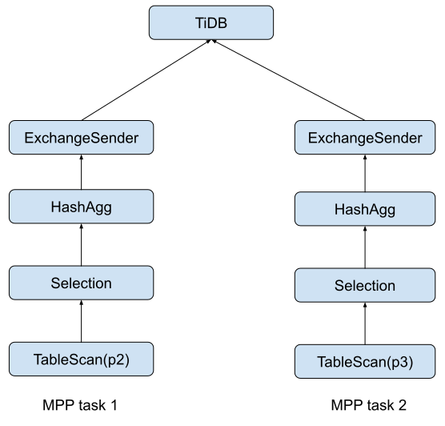
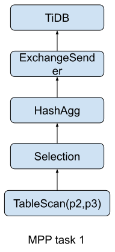

# New implementation of MPP partition table support

- Author(s): [Fei Xu](http://github.com/windtalker)

## Background

TiDB already supports the partition table, and in the storage layer, the partition table can be synced to TiFlash successfully, however, in the computing layer, TiFlash's MPP engine still does not support the partition table robustly. From the persective of the computing layer, one of the most important characteristics of the partition table is partition pruning. Currently, TiDB has two mode of partition prune:

### Static partition prune

In this mode, partition prune happens at compile time. If TiDB needs to read multiple partitions from a partition table, it simply uses the `PartitionUnion` operator to union all the partition scans. A typical plan under static prune is

```sql
mysql> explain select count(*) from employees where store_id > 10;
+------------------------------------+----------+-----------+-------------------------------+-----------------------------------+
| id                                 | estRows  | task      | access object                 | operator info                     |
+------------------------------------+----------+-----------+-------------------------------+-----------------------------------+
| HashAgg_13                         | 1.00     | root      |                               | funcs:count(Column#10)->Column#9  |
| └─PartitionUnion_14                | 2.00     | root      |                               |                                   |
|   ├─StreamAgg_29                   | 1.00     | root      |                               | funcs:count(Column#12)->Column#10 |
|   │ └─TableReader_30               | 1.00     | root      |                               | data:StreamAgg_18                 |
|   │   └─StreamAgg_18               | 1.00     | cop[tikv] |                               | funcs:count(1)->Column#12         |
|   │     └─Selection_28             | 3333.33  | cop[tikv] |                               | gt(test.employees.store_id, 10)   |
|   │       └─TableFullScan_27       | 10000.00 | cop[tikv] | table:employees, partition:p2 | keep order:false, stats:pseudo    |
|   └─StreamAgg_48                   | 1.00     | root      |                               | funcs:count(Column#14)->Column#10 |
|     └─TableReader_49               | 1.00     | root      |                               | data:StreamAgg_37                 |
|       └─StreamAgg_37               | 1.00     | cop[tikv] |                               | funcs:count(1)->Column#14         |
|         └─Selection_47             | 3333.33  | cop[tikv] |                               | gt(test.employees.store_id, 10)   |
|           └─TableFullScan_46       | 10000.00 | cop[tikv] | table:employees, partition:p3 | keep order:false, stats:pseudo    |
+------------------------------------+----------+-----------+-------------------------------+-----------------------------------+

```

### Dynamic partition prune

In this mode, partition prune happens when TiDB generates executor. Compared to static partition prune, dynamic partition prune has at least two advantages:

- The plan is more elegant
- Using dynamic partition prune, TiDB can use some runtime information to do the partition prune. For example, in index join, if the probe side is a partition table, TiDB can use the data from build side to prune the partition.

A typical plan under dynamic partition prune is

```sql
mysql> explain select count(*) from employees where store_id > 10;
+------------------------------+----------+-----------+-----------------+----------------------------------+
| id                           | estRows  | task      | access object   | operator info                    |
+------------------------------+----------+-----------+-----------------+----------------------------------+
| StreamAgg_20                 | 1.00     | root      |                 | funcs:count(Column#11)->Column#9 |
| └─TableReader_21             | 1.00     | root      | partition:p2,p3 | data:StreamAgg_9                 |
|   └─StreamAgg_9              | 1.00     | cop[tikv] |                 | funcs:count(1)->Column#11        |
|     └─Selection_19           | 3333.33  | cop[tikv] |                 | gt(test.employees.store_id, 10)  |
|       └─TableFullScan_18     | 10000.00 | cop[tikv] | table:employees | keep order:false, stats:pseudo   |
+------------------------------+----------+-----------+-----------------+----------------------------------+

```

As we can see, there is no `PartitionUnion` operator, and the access object of `TableReader` operator shows the accessed partition info.

## Problem

Currently, MPP does not support `PartitionUnion` operator, so under static partition prune, all the operator above `PartitionUnion` operator can't be pushed to TiFlash:

```sql
mysql> explain select count(*) from employees where store_id > 10;
+------------------------------------+----------+-------------------+-------------------------------+-----------------------------------+
| id                                 | estRows  | task              | access object                 | operator info                     |
+------------------------------------+----------+-------------------+-------------------------------+-----------------------------------+
| HashAgg_15                         | 1.00     | root              |                               | funcs:count(Column#10)->Column#9  |
| └─PartitionUnion_17                | 2.00     | root              |                               |                                   |
|   ├─StreamAgg_35                   | 1.00     | root              |                               | funcs:count(Column#12)->Column#10 |
|   │ └─TableReader_36               | 1.00     | root              |                               | data:StreamAgg_23                 |
|   │   └─StreamAgg_23               | 1.00     | batchCop[tiflash] |                               | funcs:count(1)->Column#12         |
|   │     └─Selection_34             | 3333.33  | batchCop[tiflash] |                               | gt(test.employees.store_id, 10)   |
|   │       └─TableFullScan_33       | 10000.00 | batchCop[tiflash] | table:employees, partition:p2 | keep order:false, stats:pseudo    |
|   └─StreamAgg_56                   | 1.00     | root              |                               | funcs:count(Column#14)->Column#10 |
|     └─TableReader_57               | 1.00     | root              |                               | data:StreamAgg_44                 |
|       └─StreamAgg_44               | 1.00     | batchCop[tiflash] |                               | funcs:count(1)->Column#14         |
|         └─Selection_55             | 3333.33  | batchCop[tiflash] |                               | gt(test.employees.store_id, 10)   |
|           └─TableFullScan_54       | 10000.00 | batchCop[tiflash] | table:employees, partition:p3 | keep order:false, stats:pseudo    |
+------------------------------------+----------+-------------------+-------------------------------+-----------------------------------+

```

For dynamic partition mode, MPP has a naive support:

```sql
mysql> explain select count(*) from employees where store_id > 10;
+--------------------------------+----------+--------------+-----------------+---------------------------------------------------------+
| id                             | estRows  | task         | access object   | operator info                                           |
+--------------------------------+----------+--------------+-----------------+---------------------------------------------------------+
| HashAgg_21                     | 1.00     | root         |                 | funcs:count(Column#11)->Column#9                        |
| └─TableReader_23               | 1.00     | root         | partition:p2,p3 | data:ExchangeSender_22                                  |
|   └─ExchangeSender_22          | 1.00     | mpp[tiflash] |                 | ExchangeType: PassThrough                               |
|     └─HashAgg_9                | 1.00     | mpp[tiflash] |                 | funcs:count(1)->Column#11                               |
|       └─Selection_20           | 3333.33  | mpp[tiflash] |                 | gt(test.employees.store_id, 10)                         |
|         └─TableFullScan_19     | 10000.00 | mpp[tiflash] | table:employees | keep order:false, stats:pseudo                          |
+--------------------------------+----------+--------------+-----------------+---------------------------------------------------------+

```

In runtime, each partition scan will be instantiated as a MPP task, so when running the above sql, TiDB will generate two MPP task:

<p align="center">
  
</p>
Under this implementation, an obvious problem is the number of the MPP tasks will increase as the number of partitions increases. Considering that it is common for a partition table with more than 100 partitions, a full table scan of the partition table may generate hundreds of MPP tasks. And currently, TiDB MPP does not have a sophisticated task schedule strategy, it simply dispatches all the MPP tasks at the same time to TiFlash, too many MPP tasks will cause some known issues in TiFlash(for example, the threads number will be out of control, and TiFlash server may even crash if there is no resource to allocate new thread), so TiFlash will not be able to provide services stably when the number of partitions is very large.

## Solution

Since the naive support of the partition table does not meet the GA standards, we need to redesign it. Considering that dynamic partition prune is the future of TiDB's partition prune strategy, we only support MPP in dynamic partition prune mode.

Under dynamic partition prune, the biggest problem for MPP is the number of MPP tasks will increase as the number of partitions increases, to solve this problem, an intuitive idea is to hide the partition behind `TableScan` operator, we need to support a new table scan operator to read data from multiple partitions:

<p align="center">
  
</p>

## Changes

### Protocol layer

Both [kvproto](https://github.com/pingcap/kvproto) and [tipb](https://github.com/pingcap/tipb) need to be enhanced. In tipb, a new executor `PartitionTableScan` needs to be added, it mainly records the partitions that need to be scanned. Furthermore, when TiDB scan a table/partition, it only scan a set of Regions in the table/partition, so in kvproto, we need to add all the <PartitionId, Regions> needed to be scanned in DispatchMPPTaskRequest

### TiDB

The main changes will be how to generate MPP task after partition prune. Currently, after partition prune, for each partition, `constructMPPTasksForSinglePartitionTable` will generate a MPP task. In order to generate a MPP task for all the partitions, a new function like `constructMPPTasksForPartitionTable` should be added, it will convert the table scan to PartitionTableScan, and set the <PartitionId, Regions> correctly, furthermore, it needs to consider the load balance strategy between all the TiFlash nodes for all the partitions.

### TiFlash

TiFlash needs to support a new executor: `PartitionTableScan`, it contains multiple partitions.  `handleTableScan` in TiFlash only support one table/partition now, it has to be enhanced to support multiple partitions, and TiFlash also need to handle remote read for different partition table correctly.
