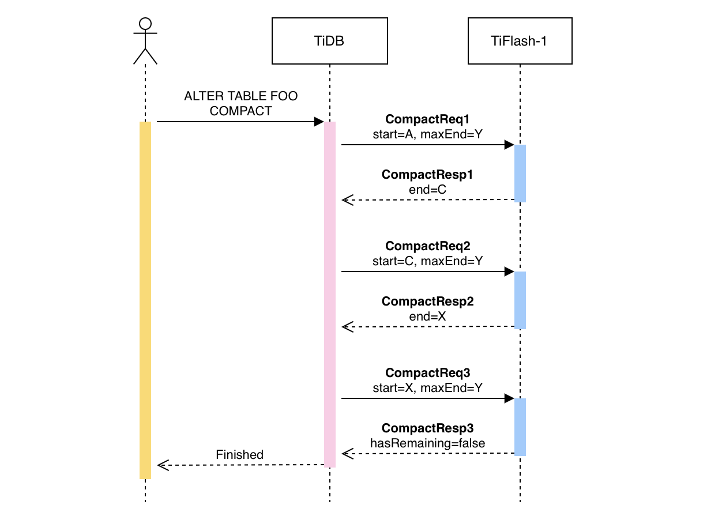
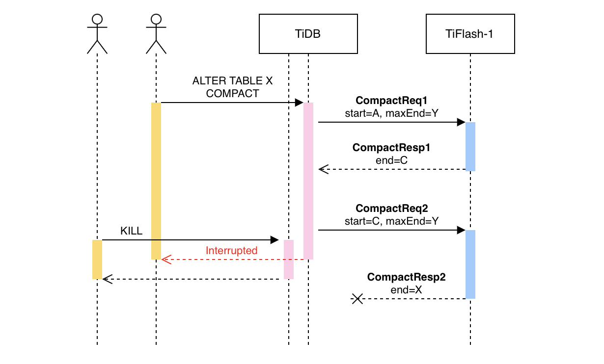
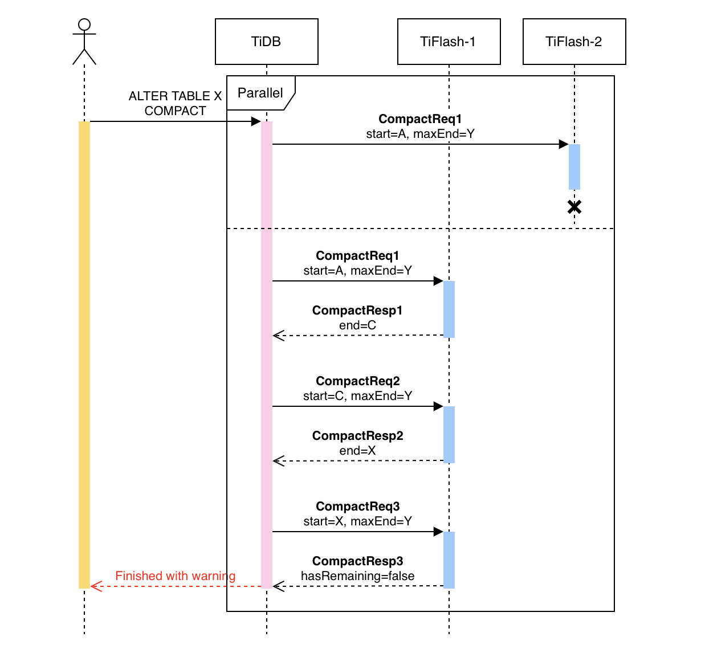
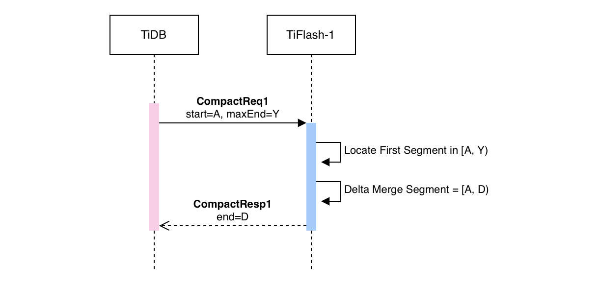
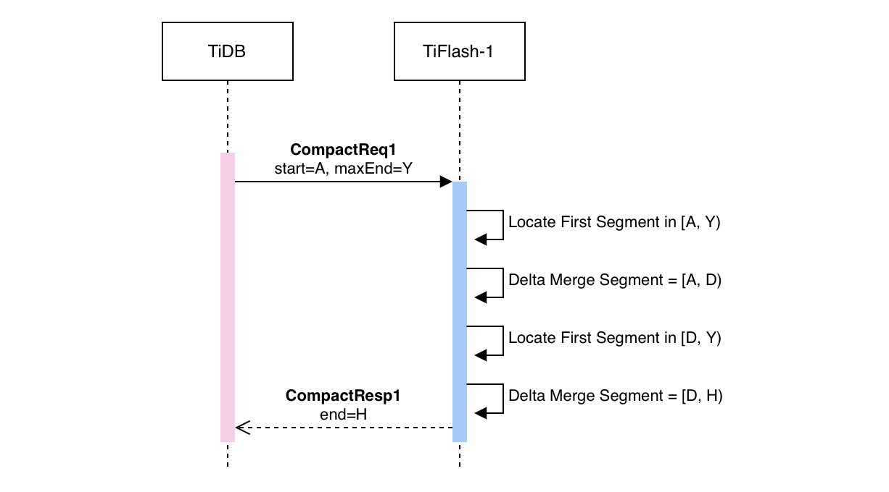
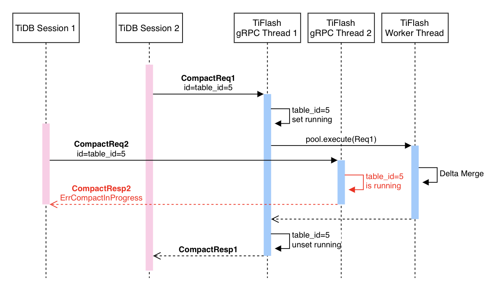
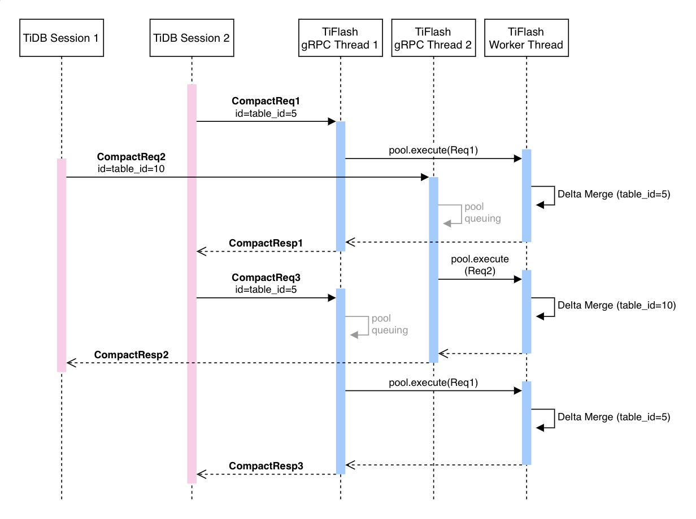

# Compact Table via SQL

- Author(s): [Wish](http://github.com/breezewish)

## Introduction

This RFC introduces a compaction SQL command in TiDB. The command triggers a
compaction on TiFlash replicas, which can be used to:

1. Migrate from PageStorage v2 to PageStorage v3
2. Optimize performance by better organizing the data

## Motivation or Background

Recently the PageStorage v3 engine was introduced to TiFlash. By allowing
users to manually trigger the compaction, the migration from PageStorage v2 to
PageStorage v3 can be done easily, as a compaction command will merge and clear
all delta layer data (which was stored in v2) into the stable layer, while new
delta layer data will be stored in PageStorage v3.

As a bonus, even when the Delta layer is already stored in PageStorage v3, users
can also benefit from this manual compaction command, considering that
compaction will rewrite the stored data into a better organized state.

## Product Behavior

New SQL syntax:

```sql
ALTER TABLE table_name COMPACT [engine_type REPLICA]
-- engine_type could be either TIKV or TIFLASH
```

Sample SQLs:

```sql
ALTER TABLE `users` COMPACT;                  -- Implicit: Not recommended
ALTER TABLE `users` COMPACT TIFLASH REPLICA;  -- Explicit: Recommended
```

- The compaction is triggered immediately and runs in the foreground. The SQL
  won’t return until the compaction is done.
- When a table is already in compacting progress, the new compaction SQL command
  involving this table will be exited immediately by producing a “canceled”
  warning.
- The compact SQL commands can be executed on different tables simultaneously,
  resulting in multiple tables being compacted simultaneously.
- When `engine_type` is specified as `TIKV`, “unsupported” error will be
  returned. When `engine_type` is not specified, the SQL will run as compact
  TiFlash replicas only. This behavior will change when we support TiKV compaction
  in future.
- When the table contains multiple partitions, all partitions will be compacted.
- The compact command will exit in the following ways:
  1. User kill SQL via `KILL [TIDB] <ID>`: stop task immediately
  2. TiDB stopped: the compaction run on TiFlash should be stopped. There will
     be no retries after TiDB is restarted.
  3. TiFlash stopped: the compaction command should stop and return error
     immediately. There will be no retries after TiFlash is restarted.
  4. Compaction is finished.

## Detailed Design

### Protocol

New APIs will be added to TiFlash:

```protobuf
// Pseudo code

message Error {
    oneof {
        ErrorCompactInProgress,
        ErrorTooManyPendingTasks,
        // More errors can be added in future
    }
}

message ErrorCompactInProgress {}

message ErrorTooManyPendingTasks {}

message CompactRequest {
    bytes id
    bytes start_key   // Optional
    bytes max_end_key // Optional
    int64 physical_table_id // Used to locate the TiFlsh table
}

message CompactResponse {
    optional Error error
    bool has_remaining
    bytes compacted_start_key
    bytes compacted_end_key
}
```

### General Flow



TiDB sends `CompactRequest` to one TiFlash instance in series. Each request
compacts one or multiple Segments in the TiFlash instance. The segments may
change (e.g. split or merge) during the SQL execution process so that TiFlash
will respond with the end key for each request, which will be then used as the
`StartKey` for the next request sent from TiDB.

When there are multiple TiFlash instances, TiDB talks with each TiFlash
concurrently. However, for each TiFlash connection, requests are still sent in
series. Newly added TiFlash instances during a compaction SQL execution are
discarded.

### Interrupt Execution (Kill)



When user executes `KILL [TIDB] <ID>` to interrupt the compaction command,
TiDB simply stops the execution by not sending future `CompactRequest`.
There will be `CompactRequest` running in TiFlash instances at the moment when
user initiates the `KILL`. These running "small" compaction tasks will be
untouched and kept running until finished. There is no way to stop a running
`CompactRequest` in TiFlash.

### On TiDB Restart

Similar to Kill, TiDB does not need to do anything extra after the restart.
TiFlash will be returned to idle after currently running `CompactRequest` are
finished.

### On Request Error

The `CompactRequest` from TiDB to TiFlash may fail for several reasons, for
example, encountering network failures or receiving errors from TiFlash.
In such case, there will be no more future `CompactRequest` sent to this
failed TiFlash instance during the compaction command. Requests will
continue sending to other TiFlash instances.



### Service Endpoint

A new gRPC endpoint will be added to the tikv gRPC service:

```protobuf
service Tikv {
    // Existing endpoints
    rpc KvGet(kvrpcpb.GetRequest) returns (kvrpcpb.GetResponse) {}
    rpc KvScan(kvrpcpb.ScanRequest) returns (kvrpcpb.ScanResponse) {}
    rpc KvPrewrite(kvrpcpb.PrewriteRequest) returns (kvrpcpb.PrewriteResponse) {}
    ...

    // Newly added management endpoint
    rpc Compact(managementpb.CompactRequest) returns (managementpb.CompactResponse) {}
}
```

### Handling CompactRequest in TiFlash



The `CompactRequest` will be processed one by one in a new thread pool with 1
worker thread. When one request is being processed, TiFlash locates the Segment
according to `start_key` and then performs a foreground Delta Merge.

The number of worker thread can be configured in case of users want more table
compaction concurrency. Note that compaction is always stepped in serial for a
single table, even if there are more than 1 worker threads.

### Compact Multiple Segments in One Request

When Delta Merge takes a short time, TiFlash repeats itself to compact more
Segments, until either:

- 1 minute (can be configured) has elapsed since receiving the request
- There are no more Segments in `[start_key, max_end_key)`
  This can speed up the compaction process when there are many compacted
  segments by reducing round trips.



### Multiple Compaction Command from Same Table

Compacting the same table concurrently doesn't make sense and leads to extra
resource costs, so that we would like to avoid concurrent compactions for the same
table, allowing only one to be executed.

In order to detect such cases, an `ID` field is attached to the `CompactRequest`,
which will be set as the Table ID in TiDB. TiFlash adds ID to a map when the
request is received, and removes ID from the map when the response is going
to be returned. If ID exists in the map, `ErrorCompactInProgress` will be
returned immediately, without processing the request in the thread pool at all.



### Multiple Compaction Command from Different Tables

As there is only one worker thread, when user invokes multiple compaction
command concurrently, these compactions will be stepped evenly, instead of
following a FIFO order, as demostrated below:



If there are too many queued requests (>N), new requests will be rejected
and `ErrorTooManyPendingTasks` will be returned. This effectively means, the
number of concurrent running compact commands will be limited to max N.

# Investigation & Alternatives

- The Compact API can be placed in TiKV Debug Service (`debugpb`). There is even
  existing `debugpb.CompactRequest`. However,
  - All TiKV Debug Service endpoints are only used by tikv-ctl, instead of
    TiDB or any other clients now.
  - `debugpb.CompactRequest` is not suitable to be used by TiFlash, containing
    too many TiKV specific fields and lacking fields for TiFlash. It will also be
    hard to modify it while keeping compatibility + clean.
- The Compact API can be provided via `DBGInvoker`, which means it available via
  Clickhouse Client SQL or TiFlash HTTP Service. This is also the home of most
  management or debug APIs of TiFlash. However,
  - Currently TiDB does not talk to TiFlash in this way.
  - We require this API to be stable for TiDB to use. All APIs in DBGInvoker
    are human-facing, not producing machine readable and stable output now.

# Unresolved Questions

None.
