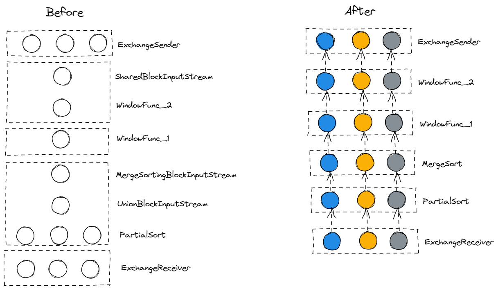

# TiFlash Design Documents

- Author(s): [guo-shaoge](http://github.com/guo-shaoge)
- Discussion PR: https://github.com/pingcap/tiflash/issues/4631
- Tracking Issue: https://github.com/pingcap/tiflash/issues/4631

## Table of Contents

* [Introduction](#introduction)
* [Motivation or Background](#motivation-or-background)
* [Detailed Design](#detailed-design)
* [Test Design](#test-design)
    * [Functional Tests](#functional-tests)
    * [Compatibility Tests](#compatibility-tests)
    * [Benchmark Tests](#benchmark-tests)
* [Impacts & Risks](#impacts--risks)
* [Unresolved Questions](#unresolved-questions)

## Introduction

By retaining the hash attribute of the output result of operators, the subsequent operators can obtain performance improvements for free.

Taking WindowFunction as an example, after implementing fine-grained partition, the structure of MPPTask changes as follows:

By retaining the hash attribute of the ExchangeSender of the hash partition, fine-grained shuffle is performed in advance,
and the most time-consuming MergeSorting + WindowFunction can be optimized from single thread to multi-threaded, making full use of multi-threading capabilities.

HashAgg and HashJoin can also use the same method to improve performance, but this document only describes the implementation of fine-grained shuffle with WindowFunction.

## Motivation or Background
TiFlash does not make full use of the hash attribute of the operator output, such as HashJoin, HashAgg and the hash partition of the Exchange operator.

For example, WindowFunction can use the hash attribute of ExchangeSender to partition data within nodes in advance and perform multi-threaded processing.
Or HashAgg can use the hash attribute of hash partition ExchangeSender to save the final merge stage.

## Detailed Design

The modification consists of three parts:
1. TiDB.
2. TiFlash Interpreter.
3. TiFlash execution.

### Changes in TiDB
TiDB can see the entire plan tree of SQL, so it's reasonable to check whether we can enable fine-grained shuffle optimization when physical plan is generated.

The general idea of checking whether fine-grained shuffle can be used or not is as following:
From the perspective of ExchangeSender, each ExchangeSender will have a target. For example, the input of WindowFunction needs to be hash partitioned,
so there will be an ExchangeSender corresponding to it, responsible for data partitioning. And the WindowFunction is the target of ExchangeSender.
If ExchangeSender's target is a WindowFunction. Then all operators between ExchangeSender and the WindowFunction will be marked as enabling fine-grained shuffle.

### Changes in TiFlash Interpreter
When compiling WindowFunction and WindowSort, if fine-grained shuffle is enabled (fine_grained_shuffle_stream_count is greater than 0),
it will be compiled into a multi-threaded structure, otherwise the original single-threaded structure will be used.

### Changes in TiFlash execution
#### ExchangeSender
Like the original logic, ExchangeSender performs a hash partition every time it receives batch_size rows.

The difference is that the hash partition not only distinguishes which node should send for each row,
but also distinguishes which specific stream within the node should be sent to, as shown in the following figure:
The first 4 buckets will be sent to tiflash-0, the second 4 buckets will be sent to tiflash-1 and the third 4 buckets will sent to tiflash-2.
Each bucket will be handled by different streams within specific one tiflash node.

An array will be added in `MPPDataPacket`, which will corresponds to the `MPPDataPacket.chunks` array.
Then `MPPDataPacket.chunks[i]` should be processed by `streams[MPPDataPacket.stream_ids[i]]`.

#### ExchangeReceiver
In the current implementation, ExchangeReceiver has only one MPMCQueue.

If fine-grained shuffle is enabled, there should be multiple MPMCQueues, which correspond to each stream.

## Test Design

Testing includes end-to-end test as well as unit test.

### Functional Tests

- End-to-end random testing for correctness.

### Compatibility Tests

Mainly considers the cluster with mixed versions of tiflash:
1. Old version TiDB sends MPPTask to new version TiFlash.
2. New version TiDB sends MPPTask to old version TiFlash.
3. Cluster of TiFlash with mix of old and new versions.

### Benchmark Tests

- There should be no performance regression even if fine-grained shuffle is disabled,
- Expect linear performance improvement for E2E performance test and microbenchmark.

## Impacts & Risks

1. The value of `@@tiflash_fine_grained_shuffle_stream_count` and `@@tiflash_fine_grained_shuffle_batch_size` can affect performance.
2. When severe data skew occurs, may have performance regressions if fine-grained shuffle is enabled.

## Unresolved Questions
None.
