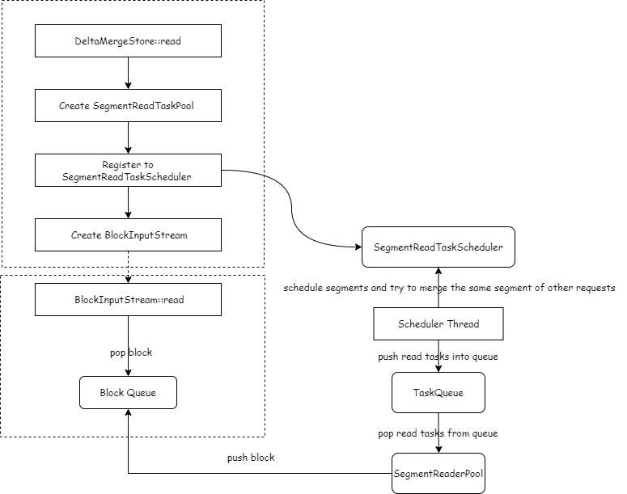

# DeltaTree Read Thread Pool and Data Sharing

- Author: [Jinhe Lin](https://github.com/JinheLin)

## Table of Contents

* [Introduction](#introduction)
* [Motivation or Background](#motivation-or-background)
* [Detailed Design](#detailed-design)
* [Impacts & Risks](#impacts--risks)

## Introduction

DeltaTree is the columnar storage engine of TiFlash.

**Read Thread Pool** is a new component of DeltaTree that responsible for reading data and decoupling the computing layer and the storage layer.

At the same time, in order to improve the performance of multi-concurrent table scan, the threads of the storage layer will schedule and try to combine data read requests according to the characteristics of analytical requests, so that concurrent table scans on the same table can share data read operations and reduce duplication of work. We calls this feature **Data Sharing**.

## Motivation or Background

### Read Thread Model

The read thread model of DeltaTree inherits from ClickHouse, which is relatively simple and straightforward：

1. Each request creates a batch of threads for processing, which can be configured by `profiles.default.max_threads`, the default is the number of physical CPU cores.(Recently, the computing layer has added thread pool to reuse threads and avoid OOT, but for the storage layer, the logic has not changed.)

2. Some computations and I/Os are done in the same thread, computations and I/Os cannot be parallelized.

The benefit of this threading model is simplicity, but it also causes some problems:

1. At low concurrency, the number of threads is small, I/O and CPU cannot be fully utilized.

2. At high concurrency, there are too many threads, and resource contention also affects performance.

Therefore, we hope to control the concurrency of table scanning by adding a read thread pool inside the storage layer, and at the same time, we can do some scheduling and merging of read requests to improve the performance of concurrent table scanning.

### Data Sharing

DeltaTree currently lacks a mechanism like data buffer pool to optimize repeated access to the same data. Also, most of the data buffer pool is designed for the hot data of OLTP workload, and the access mode of OLAP workload is quite different from that of OLTP workload. 

By referring to the papers [Cooperative Scans](https://www.vldb.org/conf/2007/papers/research/p723-zukowski.pdf) and [From Cooperative Scans to Predictive Buffer Management](http://vldb.org/pvldb/vol5/p1759_michalswitakowski_vldb2012.pdf), we propose a "Data Sharing" strategy suitable for OLAP workloads to optimize the overhead of repeatedly accessing the same data of concurrent requests. 

Data Sharing allows concurrent requests to share the reading data, reducing repetitive work such as I/O and decoding.

## Detailed Design

### Overview

From the high level of view, the reading of DeltaTree is divided into two steps:

1. Call `DeltaMergeStore::read` to create multiple `BlockInputStreams`s: obtain the `Segment`s to be read and create snapshots.

2. Call `BlockInputStream::read` to read data, one `Block` object at a time.

The detailed process is shown in the following figure:

1. When calling `DeltaMergeStore::read` to create multiple `BlockInputStream`s, register the segments to be read to `SegmentReadTaskScheduler`.
2. The logic of the `BlockInputStream` is relatively simple, just pop the `Block` objects from a `Block` queue.
3. Scheduler thread is responsible for scheduling read tasks on `SegmentReadTaskScheduler`. During scheduling, concurrent read of the same segment will be merged, and read requests will be sent to the read thread pool through the queue for processing.
4. After the read thread pool reads the block from the segment, push it to the block queue.

### ReadThreadPool

In order to avoid segments are processed across different NUMA nodes that affects performance :
1. Group the read threads according to NUMA nodes and bind them to the corresponding CPU.
2. The read task is hashed according to the segment's id, so it can be always processed by the same NUMA nodes.

### SegmentReadTaskScheduler

1. The purpose of `SegmentReadScheduler` is to allow the same segment of different read requests to be executed at the same time as much as possible to increase the opportunity of sharing the same data.
2. When a `BlockInputStream` is created, all relevant segments will be registered to the `SegmentReadTaskScheduler`. `SegmentReadScheduler` maintains all the segments' read information of this process.
3. The basic logic of scheduling is:
   1. Select a read request that needs to be scheduled.
   2. Select one segment of this read request, and consider merging other read requests that want to read this segment.
   3. Push the segment to the task queue of read threads.

### DataSharingCache

The data read by Segment includes two parts: Delta layer and Stable layer. The data of the Delta layer is generally relatively small, and currently only the data read of the Stable layer is shared. The data of the Stable layer is stored in `DMFile`, so data sharing is mainly data sharing between different `DMFileReader`s of the same `DMFile`.
1. Each `DMFileReader` holds a `DataSharingCache` to store data that may be read in the future.
2. When a `DMFileReader` successfully reads a column's data block, it tries to send it to the cache of other `DMFileReader`s. All the `DMFileReader`s are in indexed by a global object call `DMFileReaderPool`.
3. When `DMFileReader` reads, it will first try to read from the cache, and then read from the disk if it cannot read.

## Impacts & Risks

Since the scheduling order of segments is not guaranteed, the order of blocks that returned by a `BlockInputStream` is no longer guaranteed in order. This may break some special optimizations of the optimizer in some special queries, such as `SELECT MAX(pk) FROM t` ('pk' is the primary key of the table).

In order to be compatible with these special queries (in fact, most of TiFlash's queries do not rely on the order of blocks), storage engine will check whether the query plan needs to scan the table sequentially. If the query plan needs to scan the table sequentially, it scans the table in the old way.