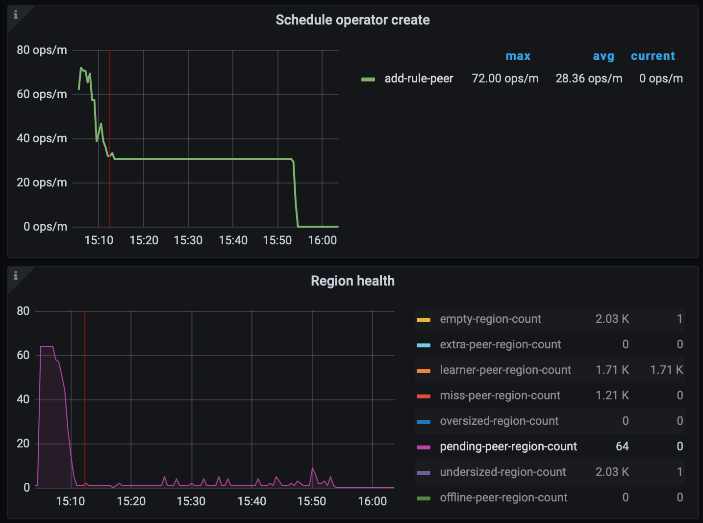
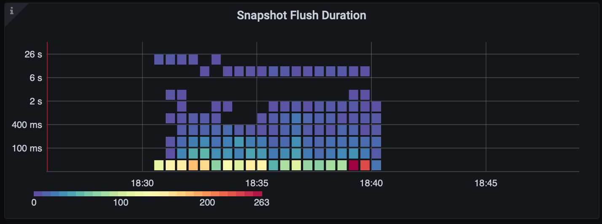
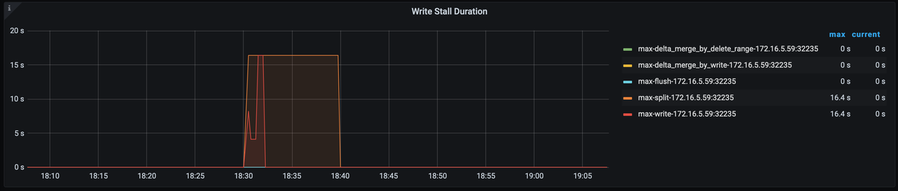
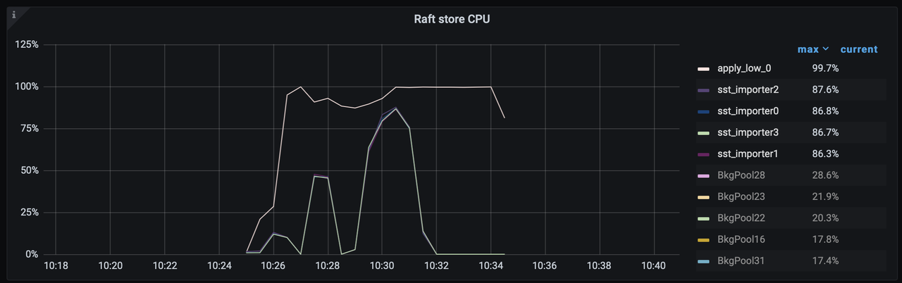

# Improve Snapshot Ingestion

- Author(s): [Wish](http://github.com/breezewish)

## Introduction

Currently TiFlash may easily meet write stalls when ingesting snapshots. The
ingestions come from:

- BR / Lightning Importing: Ingest SST
- Adding / Removing TiFlash replica: ApplySnapshot

Additionally, TiKV is introducing Big Regions in the [Dynamic Region RFC](https://github.com/tikv/rfcs/blob/master/text/0082-dynamic-size-region.md).
Ingesting a big snapshot from the big region will also be problematic.

This RFC improves the process of ingesting snapshots.

## Background

Improvements come from a thorough study of what's wrong in the current code
base, which will be covered in this section.

### Ingest Snapshot

TiFlash will ingest "data snapshots" in the form of SST files in these cases:

- `SET TIFLASH REPLICA [N]`: Raft Snapshots are sent to TiFlash for each region.
  Each snapshot contains everything so far in the region. We call this process
  **ApplySnapshot**.

  Note: When TiFlash learner falls behind a lot, ApplySnapshot will also happen,
  since incremental raft logs are compacted and cannot used to send to TiFlash.

- Using BR / Lightning to restore data into a table with TiFlash replica: SST
  files are sent to TiFlash in a Raft Message "Ingest SST". We call this process
  **IngestSST**.

The IngestSST operation provided by RocksDB (and thus TiFlash) is to bulk load
data without erasing existing data, so that we need to keep this behavior.

### ApplySnapshot Process

This process is bounded by the following rate limits:

- PD schedule threshold
- TiKV Snapshot generation thread size
- TiKV Snapshot write rate limit
- TiFlash Snapshot decode thread size
- TiFlash Snapshot write rate limit
- Hard limit: [snapshot-worker](https://github.com/pingcap/tidb-engine-ext/blob/raftstore-proxy-6.1/components/raftstore/src/store/fsm/store.rs#L1367) is single threaded.

Next, we will analyze the bottleneck of this process.

#### Default Configuration: Apply Snapshot for 100GB

In this case, the speed is limited by PD schedule threshold.

*pending-region is low, means TiFlash ingests snapshots quickly:*



#### Adjusted Configuration: Apply Snapshot for 100GB

After relaxing all soft-coded restrictions by adjusting configurations,
ingestion will be ultimately blocked by the single-threaded snapshot worker
write stall caused by segment too large.

*"Snapshot Flush Duration" is the time of each task spent in snapshot worker:*



*The major reason for slow Snapshot Flush is foreground segment split:*



Typical event timeline happened in one segment during the workload:

1. (Segment is split out)
2. Delta is large, Prepare merge delta
3. snapshot-worker: Ingest × N
4. snapshot-worker: Write stall...
5. Apply merge delta
6. Prepare split (started by apply merge delta)
7. snapshot-worker: Ingest × N
8. snapshot-worker: Write stall...
9. Apply split
10. (Back to 3)

Note, when snapshots are applied slower using default config, there will be no
write stalls. However the overall write amplification will be larger because
"merge delta" operation is likely to be triggered for every ingested snapshots.

Appendix: Adjusted configurations for TiKV and TiFlash:

```yaml
tikv:
  import.num-threads: 16
  raftstore.snap-generator-pool-size: 12
  server.snap-max-write-bytes-per-sec: 1GiB
tiflash-learner:
  import.num-threads: 16
  raftstore.apply-low-priority-pool-size: 40
  raftstore.snap-handle-pool-size: 40
  server.snap-max-write-bytes-per-sec: 1GiB
```

### IngestSST

Unlike ApplySnapshot, IngestSST is bounded by different rate limits:

- BR / Lightning configuration / bandwidth
- TiKV Importer thread size (default=8)
- TiFlash Importer thread size (default=4)
- TiFlash low-priority Apply thread size (default=1)

#### Default Configuration: Ingest SST for 100GB

We can see that the performance is limited by the low-priority Apply thread.



Typical event timeline happened in one segment when using TiDB Lightning:

1. (Segment is split out)
2. Delta is large, Prepare merge delta
3. Ingest
4. Apply merge delta
5. Delta is large, Prepare merge delta
6. Apply merge delta
7. Ingest
8. Delta is large, Prepare merge delta
9. Apply merge delta
10. Prepare split (started by apply merge delta)
11. Ingest
12. Apply split

#### Adjusted Configuration: Ingest SST for 100GB

TiFlash only lags 1min for 100GB data (1 TiKV : 1 TiFlash) in this case. The
write amplification is also reduced from 1.64 to 1.02, because repeated merge
delta is greatly reduced (500%). Typical event timeline:

1. (Segment is split out)
2. Delta is large, Prepare merge delta
3. Ingest × N
4. Apply merge delta
5. Prepare split (started by apply merge delta)
6. Ingest × N
7. Apply split

The new bottleneck in this case is the TiFlash write stall due to delta too
large and segment too large, multiple threads need to wait for the same segment
to merge delta or split.

## Detailed Design

### General Ideas

1. To improve ApplySnapshot performance, we need to **ensure that ingesting**
   **snapshots finishes instantly** and will not easily cause foreground write
   stalls. In this way, the single-threaded apply worker will not be blocked.
   Write stall should happen only when background workers are too busy.

2. To improve IngestSST performance, in addition to the configuration change,
   we can further **reduce write stalls for hot segments**. Otherwise the
   multi-threaded pool will be easily drained out quickly, waiting for the
   single segment.

   This further improvement will be covered in future RFCs, not in this RFC.

### Improvement Changes

#### 1. Multi-threaded IngestSST

Low Priority Apply Pool size will be increased from 1 to, for example, 4 or 8,
which is chosen automatically according to the number of CPU cores that TiFlash
is allowed to use, so that IngestSST can be parallelized.

During BR restore, TiKV utilizes full resources and causes business impacts.
At this moment TiFlash should also utilize more resources in order to speed up
the restore and minimize the impact time.

Parallelized ingestion also reduces the overall write amplification.

#### 2. Direct ingest into stable for ApplySnapshot

Consider the case that we are applying a snapshot to a segment. The segment may
contain overlapped data:



Previously, the snapshot is ingested into the delta layer as a ColumnFileBig.
In this RFC, we will do the following instead:

1. Write DeleteRange to the target ingestion range, as what we did previously.

2. Logical-split the segment according to the range of the snapshot:

   

3. Replace the segment with the snapshot by placing the snapshot DTFile into
   the stable directly, then clear the delta layer:

   

Remember that, for ApplySnapshot, we always clear all data in the range, so
that substituting everything in the segment with the snapshot content will not
cause correctness issues.

The snapshots may be very small or even empty. For these small snapshots
(<16MiB), we will still ingest them into the delta layer, without doing logical
split or segment replacement.

#### 3. Merge Multiple Segments, triggered by GC Thread

After change 2 is applied, there will be many small-sized segments, e.g.
around 96MB or 0. To maintain better DeltaTree structure, we can merge these
segments into one in the background.

- Currently segment merge only takes two segments at a time. In this RFC,
  merging operation will try to take as many segments as possible to reduce the
  write amplification.

- Currently segment merge happens in the background task thread, triggered by
  write or ingest thread. However, as these small segments do not notably affect
  performance, we can defer it to later. In this RFC, we will change it to be
  triggered by the GC thread. This could also be helpful to reduce repeated
  segment split & merge.

#### 4. Split Snapshots into multiple DTFiles according to Segment size

When snapshot size is larger than segment size, for example, consider it as
10GiB, which may happen when dynamic region is enabled. In change 2, we will
have a standalone segment of size 10GiB first, and then it will be split and
become smaller segments. During this process, write stall happens as it exceeds
the max segment size.

We can write into multiple DTFiles sequentially, cut by the size of segment
size, when transforming from row to column. In this way, the newly formed
segment will not be too large and will not cause write stalls.

## Impacts & Risks

None

## Investigation & Alternatives

See background section for current bottlenecks.

## Unresolved Questions

None
