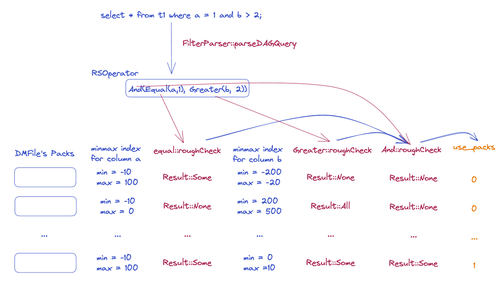

# Enhance null value support for minmax index

- Author: [Yunyan Hong](https://github.com/hongyunyan)

## Introduction

This RFC makes TiFlash better using minmax indexes for the scenarios that packs contain null values.

## Motivation or Background

Currently, TiFlash does not use the minmax index for packs with Null values. Thus, for scenarios with many Null values on scattered distribution, the filtering effect of the minmax index is quite poor.

Considering that the current TiFlash already can support the minmax index of the Nullable type, this RFC will better use the minmax index on the packs with nullable values to optimize the performance of related scenarios.

### MinMax Index Implementation

When we write into a `DMFile` , we will establish a minmax index for some columns (including handle column, and the columns whose data type satisfies `isInteger()` or `isDateorDateTime())`. We call the `MinMaxIndex::addPack` on the current column to record whether the pack has null value, whether it has values and the maximum and minimum value in this column.

```c++
class MinMaxIndex
{
private:
    using HasValueMarkPtr = std::shared_ptr<PaddedPODArray<UInt8>>;
    using HasNullMarkPtr = std::shared_ptr<PaddedPODArray<UInt8>>;

    HasNullMarkPtr has_null_marks;
    HasValueMarkPtr has_value_marks;
    MutableColumnPtr minmaxes;
}
```



As the picture shows, we will call `FilterParser::parseDAGQuery` in to parse query statements to generate related filters to push down(it called `RSOperator` in codebase).

Before we read a `DMFile`, we first load its' minmax index, and confirm whether the data in these packs needs to be read from disk based on the `RSOperator` filter. With the filter's calculation(`filter->roughCheck`), we will update the `use_packs` to instruct `DMFile` to read packs and skip packs.

Currently, if one pack contains null value, we will directly consider that the pack needs to be read, without the judgment of RSOperator. Thus it brings a lot of unnecessary reading operations when these packs actually do not have the related data. **For all the supported  filters, because we don't care whether the filtering result contains null values, the null value will not affect their filtering results**, so we consider supporting the filter judgment on packs containing null to reduce unnecessary read operations.

Our existing filter types(`RSFilterType`) containes:

```c++
And | Equal | Greater | GreaterEqual | In | Less | LessEqual | Like | Not | NotEqual | NotLike | Or
```

## Detail Design

To support minmax index filtering on packs with NULL values, we need to make the following modifications:

### Support filter calculation on packs with null values

#### 1.Modify the minmax index generation

- In the current minmax index generation(https://github.com/pingcap/tiflash/blob/8a6e4d14fd5a58887416fcc97b3988eb98b00bfa/dbms/src/Storages/DeltaMerge/Index/MinMaxIndex.cpp#L40), **the null value will be involved in the comparison of the minimum and maximum values.** That is, if there is a null value in the current column in the pack, the minimum value of the pack will be the null value (generally, the null value will be written as the default value).

- Take the picture as an example . The minimum value in this column will be 0 (just null value) but not -4, due to the fifth element being null value.


- When the minimum value is null, it is impossible to know the exact minimum value, **making it unable to fully utilize the minmax index.** Therefore, we consider modifying the minmax index generation. We **exclude the null value from participating in the calculation of min and max values**. Then in the same case as above, we can get the minimum value as -4 instread of 0.


#### 2. In the comparison of <,=,>, the null value will not participate in it (that is, the existence of the null value will not affect the filtering result), so we do not need to modify the filtering logic

#### 3. Dealing with the old versions data of minmax index

- Because the minmax index established in the old version may contain null values (when there are null values in pack), we need to do special processing for the old version minmax indexes.

- If the min value of the pack in the old version of the data is not null, we can directly use the existing filter judgment logic because it's no difference with the new minmax indexes. While if the min value of the pack is null, we can directly regard that the pack needs to be read (return `RSResult::Some` directly without filtering).

### Add new RSFilterType: IsNull

Because our minmax index records whether the column in each pack contains a null value, we can support filtering based on minmax index for the function `is null` to better optimize the performance in such query statements.

We can add a new type called `IsNull` in `RSFilterType`, and support generating an `IsNull` filter based on the statement in `parseTiExpr`.

As for the `is not null`, **it will be directly converted to `not(is null)`**, so there is no need to add a special filter for `is not null` type.

Because we ignore the null value in other filters(such as `Equal`, `Greater`, etc.), **`IsNull` filter can only do the correct filter when the filter object is a single column(e.g. `where a is null`), but not an embedded statement(e.g. `where (a < 2) is null`). Therefore, if we want to change the `IsNull` filter ability in the future, we need to be quite careful about the calculation of null values in other filters.**

### Correctness Guarantee

Null values are very special, and may lead to some correctness problems. Therefore, to guarantee correctness when applying minmax index on the pack with null values, we need to keep the following requirements:

1. The pushdown filter does not support the logical operation directly works with null. For example, we don't support push-down filtering when the statement like `select * from t1 where a or null`.

2. `IsNull` filter only supports single column expression, but not for other complex embedding statements. For example, we only support push-down filtering when the statement like `select * from t1 where a is null`, but not support for statement like `select * from t1 where (a > 1) is null`.

If we have to break these requirements in the future, we should pay more attention to the complex cases about null values.