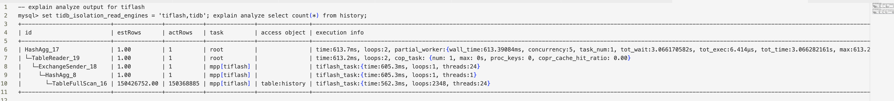
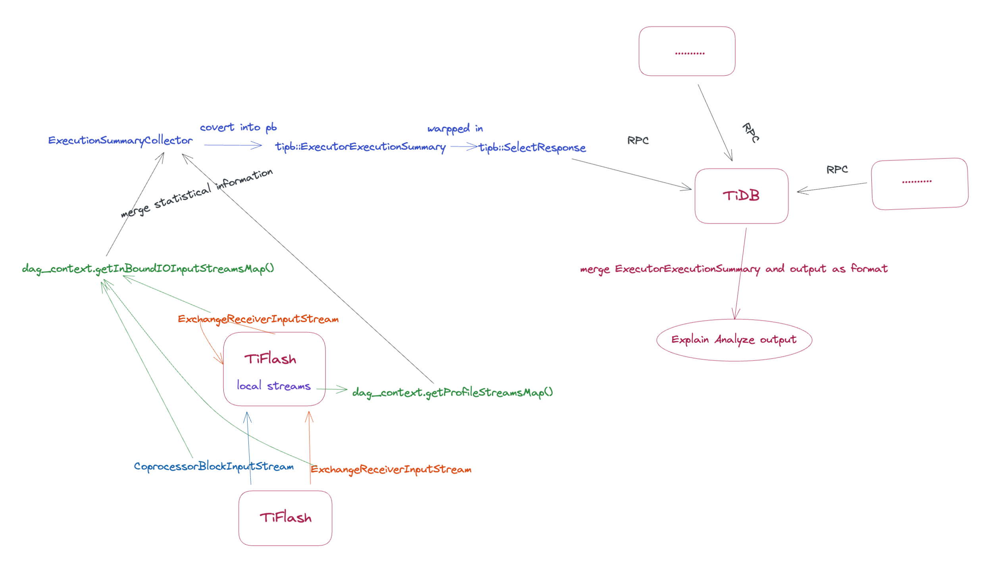

# Enrich the information of Explain Analyze for TableScan

- Author: [Yunyan Hong](https://github.com/hongyunyan)

## Introduction

Currently `Explain Analyze` show limited exection infos when SQL runs on TiFlash, mainly including:

- time: the time cost by executing this operator
- loops: the count of the blocks read by this operator, that is,  the number of times stream->read() is executed
- threads: The concurrency degree of this step, that is, the number of streams calculated at the same time
- actRows: The number of rows returned by the operator



For the storage layer of TiFlash, `Explain Analyze` misses a lot of important and meaningful information, such as

- The number of rows/packs in DMFiles scanned in the `TableFullScan/TableRangeScan` operator
- The number of rows/packs in DMFiles skipped by the rough set index in `TableFullScan/TableRangeScan` operator
- The time to load rough set index in `TableFullScan/TableRangeScan` operator
- The time to read all related DMFiles in `TableFullScan/TableRangeScan` operator
- The time to create snapshots in `TableFullScan/TableRangeScan` operator
- ...

Therefore, we consider putting more useful and meaningful information into `Explain Analyze`, to help us locate and analyze performance issues better.

In conclusion, this RFC makes `Explain Analyze` contain richer information about the `TableFullScan/TableRangeScan` operator on TiFlash.

## Background

The process of `Explain Analyze` can be divided into two parts, one is collecting the statistical information in TiFlash, the other one is sending the statistical information to TiDB.



### Collecting statistical information in TiFlash

Class `ExecutionSummaryCollector` is responsible for the collection of statistical information. It mainly collects statistical information from the following streams:

1. Collect from the streams in `dag_context.getInBoundIOInputStreamsMap()`
    - `dag_context.getInBoundIOInputStreamsMap()` mainly contains:
        - IO stream for storage level in the local node and remote nodes
        - The stream of interaction between tiflash nodes, which is `ExchangeReceiverInputStream`(for mpp) and `CoprocessorBlockInputStream`(for remote read)
    - Before this proposal, we just collect the execution summary from `ExchangeReceiverInputStream` and `CoprocessorBlockInputStream`.
2. Collect from various `IProfilingBlockInputStream` in `dag_context.getProfileStreamsMap()`
    - `IProfilingBlockInputStream` has one member called `BlockStreamProfileInfo info`, which stores the profiling information. When doing `IProfilingBlockInputStream::read`, it will simultaneously update the `BlockStreamProfileInfo info` based on the blocks the streams read.

`ExecutionSummaryCollector` combines all the collected statistical information of each stream based on their executor ids, and writes it into the `ExecutorExecutionSummary` of `SelectResponse`.

### Sending statistical information to TiDB

`ExecutorExecutionSummary` is included in `SelectResponse` and `SelectResponse` is wrapped in the data part of `MPPDataPacket`. Thus `ExecutorExecutionSummary` is sent to TiDB along with `MPPDataPacket` sent to TiDB.

When TiDB gathers the `MPPDataPacket` sent by each TiFlash node, it will merge all the `ExecutorExecutionSummary` based on their executor ids, and output the result of `Explain Analyze` according to the predetermined format.

## Detailed Desgin

### Overview

To collect the statistical information of the storage layer, we add an object called `std::shared_ptr<ScanContext>` in `DMContext` as a global counter in the query. In the read process, each query will create a new DMContext object in `DeltaMergeStore::read`, and then pass it to each stream.

Therefore, for the information that needs to be collected, we update the value on `std::shared_ptr<ScanContext>` of `DMContext` in the corresponding stream. Considering there will be multiple threads operating `std::shared_ptr<ScanContext>` at the same time, we make all update operations using atomic calculations.

```c++
class ScanContext {
public:
    std::atomic<uint64_t> scan_packs_count{0};
    std::atomic<uint64_t> skip_packs_count{0};

    std::atomic<uint64_t> scan_rows_count{0};
    std::atomic<uint64_t> skip_rows_count{0};
    
    std::atomic<uint64_t> rough_set_index_load_time_in_ns{0};
    std::atomic<uint64_t> dmfile_read_time_in_ns{0};
    std::atomic<uint64_t> create_snapshot_time_in_ns{0};
    ....
};
```

Considering that partitioned tables and non-partitioned tables involve different input streams, and in the future there may contain multiple table scan operations in one mpp task, we use an unordered_map `<executor_id, std::shared_ptr<ScanContext>>` to store it in `DAGContext`. Thus `ExecutionSummaryCollector` can fetch the `ScanContext` information directly based on the executor id.

For statistical information about storage layer in remote nodes, it will be collected in the remote nodes with other statistical information by itself, and sent to the local node in `CoprocessorBlockInputStream`. In this way, the statistical information about `TableFullScan/TableRangeScan` in both local node and remote nodes can be collected correctly.
