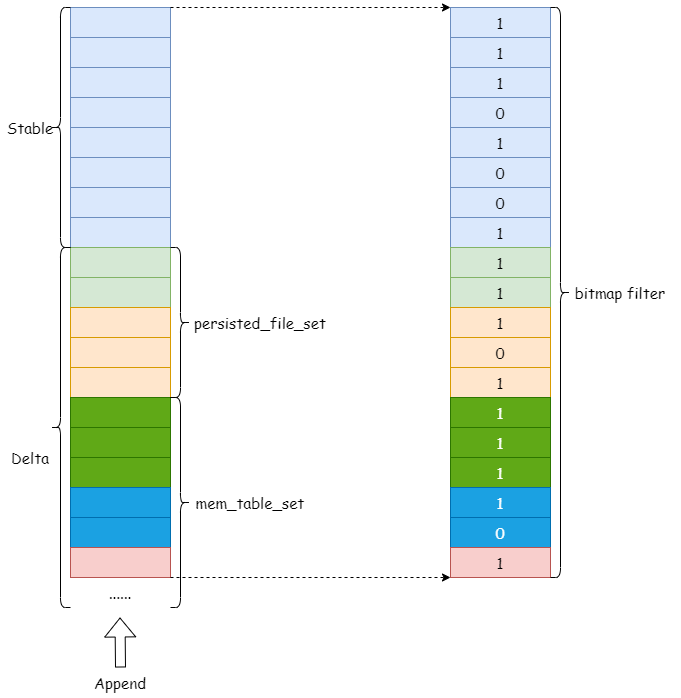

# Support MVCC Bitmap Filter
- Author: [Jinhe Lin](https://github.com/JinheLin)
## Table of Contents
- [Motivation and Background](#Motivation-and-Background)
- [Design](#Design)
	- [Decouple MVCC Filtering by Bitmap](#Decouple-MVCC-Filtering-by-Bitmap)
	- [Generation of MVCC Bitmap Filter](#Generation-of-MVCC-Bitmap-Filter)
- [Work with Other Optimizations](#Work-with-Other-Optimizations)

## Motivation and Background

In TiFlash, table scanning supports the same snapshot isolation as TiKV. Before this design, the data read process (ignoring some filtering conditions to push down) is as follows:
1. Update the DeltaIndex incrementally.
2. Read data of all columns needed by query from Delta and Stable.
3. Merge the data read from Delta and Stable with the help of DeltaIndex to get a stream of data sorted by <handle, version>.
4. Filtering with query timestamps to get a stream that matches the snapshot isolation requirements.

Step 2 and 3 will read all the columns needed for the query (likes 'eager materialization'). Although the implementation of DeltaIndex can reduce the number of comparisons, but multi-way merge sort can also resulting in a lot of small memory copies if there are many columns to read.

Moreover, the current implementation couples the logic of index filtering and late materialization with that of MVCC filtering, which is not conducive to subsequent iterative optimization.

In this design, we want to decouple the implementation of MVCC filtering and other table scanning optimizations (e.g., index filtering, late materialization) by using bitmap to reconstruct the MVCC filtering implementation of the table scanning operator. Moreover, primary key de-duplication of [fast scan](https://github.com/pingcap/tiflash/blob/master/docs/design/2022-07-19-tiflash-support-fast-mode.md) can be implemented in the future by using a cached and regularly updated bitmap.

## Design  
### Decouple MVCC Filtering by Bitmap

DeltaIndex treats data of Delta and Stable as a one-dimensional array, where a record is an element in the array, identified by the array index.

So, we can use a bitmap to represent the result of MVCC filtering. Each bit corresponds to an array index, 0 means the record of this index is filtered out, 1 means the record of this index meets the requirements.

The process of scanning the table using bitmap filter is as follows:
1. Update the DeltaIndex incrementally.
2. Read data of handle, version, tag columns from Delta and Stable and generate a row id (array index) for each row.
3. Merge the data from step 2 with the help of DeltaIndex to get a stream of data sorted by <handle, version>.
5. Filtering with query timestamps to get a stream that matches the snapshot isolation requirements.
6. Use row id to generate a MVCC bitmap filter. 
7. Read columns needed by the query from Delta and Stable independently based on the bitmap filter, without sorting.

Steps 1 to 6 are for generating MVCC bitmap filter. Step 7 is reading columns and filtering them with MVCC bitmap filter. 

The following diagram shows a simple correspondence between records and bitmaps.

### Generation of MVCC Bitmap Filter

1. We can directly use `Segment::getInputStream` to iterate through the three columns of handle, version, tag to generate an ordered stream of data.
2. However, the current input stream does not contain the position of the record on the array, so a "virtual column" needs to be added to indicate the record position. This "virtual column" will be called `SegmentRowIdCol` later.
3. In order to generate the `SegmentRowIdCol`, some changes need to be made to the read interface of Delta and Stable.
4. After the `SegmentRowIdCol` is generated, set the corresponding position on the bitmap to 1.

### Read Columns with Bitmap Filter

Since the computing layer does not require the returned data from storage to be ordered. We can read the required columns from Delta and Stable independently and filter data by the bitmap filter.

## Work with Other Optimizations

For other table scanning optimizations, such as index filtering and late materialization, can also generate a bitmap based on their filtering results. The final bitmap result is obtained by executing AND operation between bitmaps.

Moreover, these filtering operators can execute concurrently if there are enough resources.
