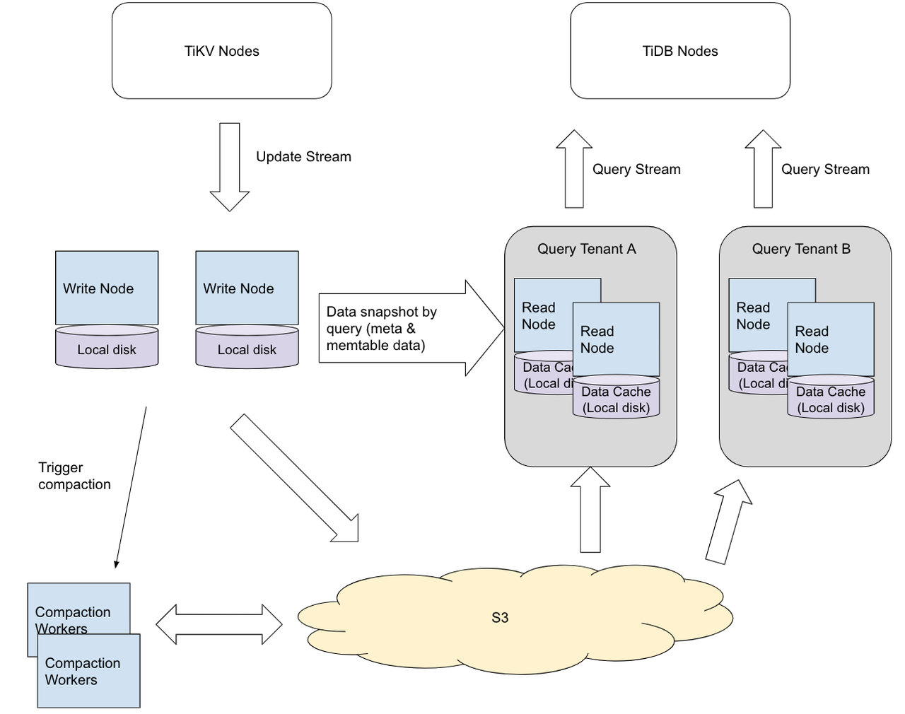
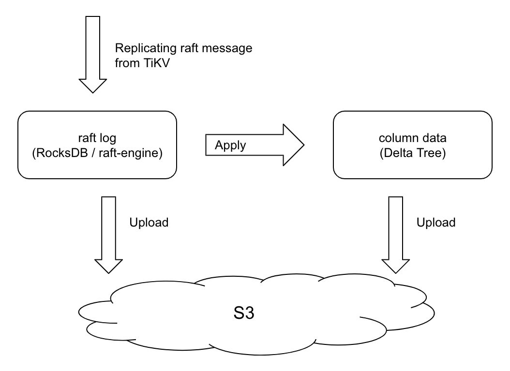
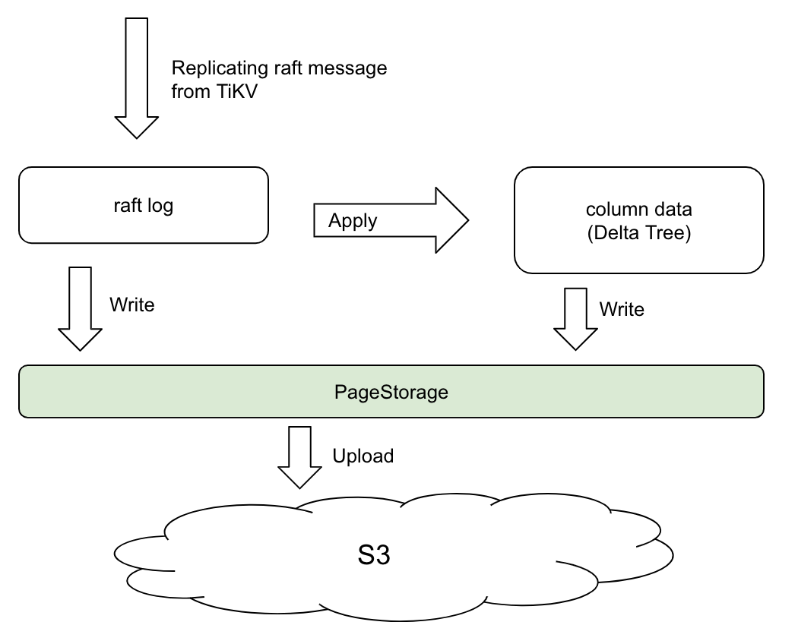

# The Design of TiFlash Cloud Native Architecture 
- Author: [flowbehappy](http://github.com/flowbehappy)

## Solve what problem?

The current TiFlash architecture is a typical shared nothing architecture, which brings some drawbacks:

1. Storage and computation cannot be scaled separately
2. Updating and reading operations are loaded on the same nodes and can affect each other, including using up IO, CPU, and other resources. AP query tasks are typically heavy and can suddenly spike in demand.
3. Slow down scaling. Scaling needs to do data synchronization between TiFlash nodes.
4. The cost-efficiency is not optimal. For example, there are only queries at night, but we need to keep TiFlash instances around.

## Basic ideas

We split TiFlash node into the following nodes:

1. <b>Write Node (WN)</b> is responsible for storing raft logs, decoding the data, and writing it to memtable. The data written to disk by memtable will be uploaded to S3 for persistence. And it triggers remote compaction as appropriate. It also provides data shopshot information for query, such as data files involved in query.
2. <b>Read Node (RN)</b> is responsible for the query. To start the query, it need to first request Writes Nodes to obtain the necessary snapshot information and Memtable data in memory, and then directly request S3 to run queries, no need to interact with Write Nodes any more. It uses the local disk that comes with the ec2 node to do data caching to improve query performance.
3. <b>Compaction Worker</b> is used to handle various background tasks from Write Nodes offload to avoid affecting the foreground thread. Since it is a stateless node, it is very convenient to apply for resources dynamically and avoid compaction delays.

## Advantages
1. Storage and calculation separation reduces deployment costs
    * Storage and computing resources can be scaled separately on demand to avoid resource mismatch
    * Light and heavy queries can be supported by different Query Tenant respectively. For example, regular heavy calculations can be temporarily started to complete the calculation and destroyed after use.
2. Read and write separation improves stability. Synchronize data, organize logic, and query load are physical separated, which can avoid heavy AP query load crowding out system resources.
3. Greatly increase the speed of volume expansion and contraction
    * Because RN is stateless, in theory, expansion and Load Balance can be completed in a few seconds.
    * The Region migration on WN does not need to resynchronize the snapshot from the TiKV , and the migration is completed directly by downloading or referencing the S3 file. It is expected that a new node can complete the Load Balance within 1min.
4. Improves Scalability while retaining the performance benefits of Locality
    * RN can use the local disk as LRU cache, so that most of the hot data does not need to read S3

## Core Design

### Main challenges

The most critical issue of this architecture is: How can the data generated by Write Node be read by Read Node in a real-time and efficient way . To solve this issue, you need to first understand the difficulties faced by this architecture in a cloud environment. Here I mainly use AWS as an example, similar to other cloud vendors.

1. Reading Node directly requesting Write Node to read data is not the best solution
    * If all the data is sent directly sent to RN via the network, it is not the most efficient solution because of the additional cost of encoding/decoding. Even if RN cache the data on the local disk, the first read will put a lot of pressure on WN. And RN is difficult to cache in this way, because the data pulled over is no completed.
    * WN has to process read requests, so it does not achieve complete separation of storage and calculation. With the increase of read load, WN is easy to become a system bottleneck

    The best solution is to let RN to read data directly from shared storage without going through WN. And this shared storage needs to meet some requirements, see 2.

2. There is no suitable shared storage for storing all data

    The main difficulty lies in latency sensitive data, including raft log data. Ideally, the storage of this part of the data should have these characteristics
    
    * Low Latency - Sync data from TiKV to TiFlash node as quickly as possible
    * Low cost - cost reduction is one of the most important goals
    * High Durability and High Availability - Quickly restore node state after ec2 failure or restart

    Options:
    
    * EFS cost is too high to achieve the purpose of cost reduction
    * AWS's EBS does have iOS types that can be accessed by multiple nodes, but it has many limitations , does not meet the needs of distributed databases for shared storage, and is expensive.
    * S3 provides high durability and high availability at a low cost. Although the throughput is high, the read and write latency is large
        * The throughput of S3 can fill the internet bandwidth of an EC2 node, such as 16 Core ec2 internet bandwidth 625 MB/s
        * But the delay is relatively high, the delay of the request is 10 ms~ 1 s

    * JuiceFS
        * According to the technical document of JuiceFS, I think JuiceFS can be used as the front end of the S3, to store IO latency insensitive data, e.g. stable data of DeltaTree. It could bring several benefits:
        * However, I do NOT think JuiceFS is suitable for IO latency sensitive data, e,g. raft logs and delta data of DeltaTree. 
        * JuiceFS only provides "close-to-open" consistency guarantee. It is not enough for TiFlash / TiFlash Proxy(a TiKV fork). We keep a file open while there are write operations. Will not close it before it has finished writing. For example, WAL files, BlobFiles in PageStorage.
        * As the updates will have to be persisted to the real storage before commit, i.e. write to  S3. JuiceFS does NOT solve the latency issue of the write path.

	| | S3 (Standard) | EBS (gp3) | Local disk | 
	| ---- | ---- | ---- | ---- |
	| Durability | 99.999999999% | 99.8% - 99.9% | Follow the ec2 node, ec2 is down or hangs up, and data loss is not guaranteed. However, the SLA of AWS guarantees that if Uptime is lower than 95.0%, it will be 100% free of charge |
	| Availability | 99.99% | No clear official doc found, let's assume it equals durability | Ditto |
	| IO Latency | 10 ms ~ 2 s | <10ms | ~100 μs |

### Solution: Use different storage to store different data

Based on the above analysis, it is impossible to find a perfect shared storage that meets all data requirements. A natural idea is to take the data into aparts and store them to different storage

1. Most of the data is stored in S3
    * Including various files written to disk in the DeltaTree storage engine
    * S3 provides high durability and high availability. So this part of the data should not be sensitive to storage latency
    * RN have to request WN for other data during queries.
2. IO latency sensitive data is directly written to Write Node's local disk and uploaded to S3 regularly. It is equivalent to using local disk as buffer
    * About durability - if data from local disk is lost, recover from TiKV. Equivalent to relying on upstream TiKV to provide high durability.
    * About availability - Data needs to be resynchronized after restart. And the time for service recovery is affected by the delay of synchronized data. Since we upload data regularly, the actual data to be resynchronized is incremental data relative to the last upload point, and the total amount should be small, so it is considered acceptable.

### How to upload S3?
According to the above design, no matter what kind of data, it will always be uploaded to S3 in the end. One of the key questions is: how to upload S3?

* Synchronous or asynchronous?
* How often to upload?
* Do you want to save batches and how to save batches?
* How to ensure consistency after data recovery from S3?

To answer the above questions, let's first look at the data distribution and flow of in TiFlash.

1. <b>Raft log</b> - raft log is the data that has just been synced from the TiKV raft leader to TiFlash , and has not yet been applied to the column storage engine (Delta Tree Engine). After applying successfully, it will be deleted.
    * It belongs to IO latency sensitive data and cannot upload S3 right after it is written.
2. <b>Column data</b> - The column data in Delta Tree Engine is divided into memtable and column file persisted on disk. Note that Delta Tree has no WAL, no flush data depends on raft log replay recovery after restart.
    * Although there is memtable as a write buffer, the write IOPS caused by Delta Tree's flush also reaches 500 IOPS under busy conditions. So this part of the data should also be counted in the storage delay sensitive data and cannot be uploaded 
    * The column file that has just been flushed to disk is usually relatively small. In order to avoid too much fragmentation, there will be compaction workers in the background to organize and merge it into a larger column file. Column files data are not IO latency sensitive nd can be uploaded to S3 before confirming that the write is successful.

If we want to use different strategies for different data types, it will undoubtedly be a lot of work.

What's more troublesome is that it is very complicated to achieve the consistency of the files saved by TiFlash in S3: How to ensure that all local IO operations can be saved to S3 in the correct way, so that TiFlash does not lose internal consistency after restoring the state from the S3 backup. There are several reasons for this difficulty.

1. Different IO types have different strategies for synchronizing to S3, namely Synchronization Mode vs Asynchronous Mode, making dependencies very difficult to manage
2. The code for handling raft log and the code for column data are in different modules, and it is difficult to establish complex dependencies between modules

### Solution: All data is stored in PageStorage
PageStorage can be treated as a local object store, which can store `PageID - > Page` pairs. Pages are bytes and sizes range from 1KB to 100MB.

1. Pages can be stored permanently while avoiding the resulting write amplification
2. It supports for External Pages, that is, storing larger Pages externally. This feature allows PS to manage large files, such as DTFile (SSTFile similar to LSM Tree).
3. It supports for Ref Pages, similar to hard link for file system
4. It supports MVCC Snapshot, that is, the application layer can obtain a fixed data view according to the Snapshot

Managing these complex IO dependencies at the application layer is doomed to have no future. We choose to store all TiFlash data in PageStorage (PS), and then PS upload all data changes regularly , which can solve the consistency problem.

It works like EBS snapshot, i.e. uploading changes to S3 periodically.

1. It has been guaranteed that if the PS state on the TiFlash disk at a certain time t is S(t), at this time restart, the PS based on the local disk can be restored to the state S(t)
2. If we get PS snapshot at time t and upload all the data in the snapshot to S3 to form file F, then the TiFlash state recovered from F must be equal to S(t)

Here is the new architecture:

## Key Implementation Points

* Store raft logs data into PageStorage. Currently it is stored in [raft-engine](https://github.com/tikv/raft-engine).
* Support generating query snapshots by WN and sending latest data to RN
* Support directly read data from S3 by RN, and cache data to local disk for faster access
* Support Fast Add Peer. i.e. TiFlash WN use the data uploaded by other WNs as region snapshot during apply snapshot. The detail design will be covered by other document.
* Support S3 GC. The data files on S3 are shared among WNs. It is difficult to decide whether a file can be deleted or not. The detail design will be covered by other document.
