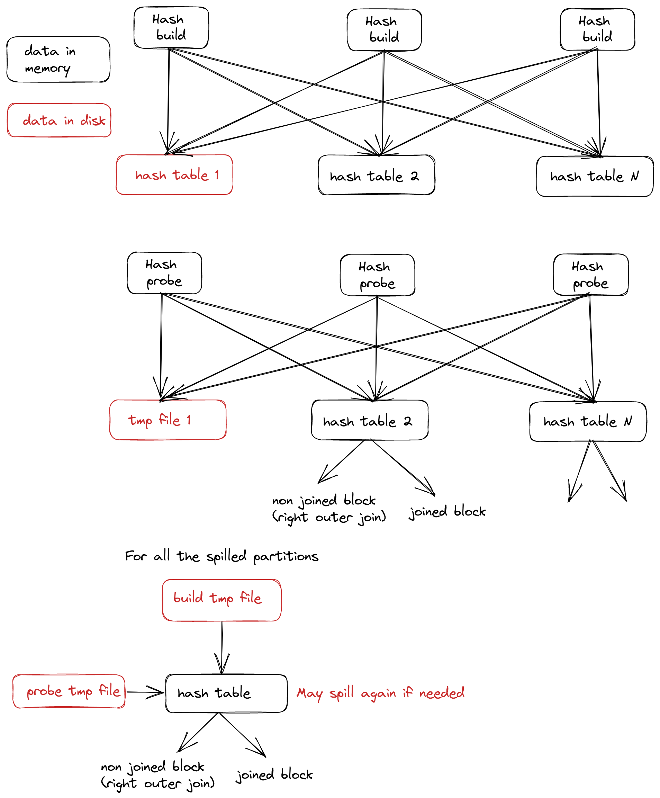
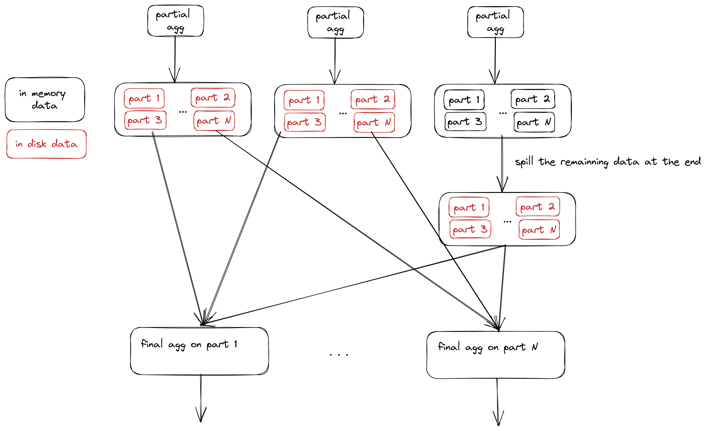

# TiFlash support spill to disk design doc

*   Author(s): [mengxin9014](https://github.com/mengxin9014), [windtalker](https://github.com/windtalker)
*   Tracking Issue:  <https://github.com/pingcap/tiflash/issues/6528>

## Table of Contents

*   [Motivation or Background](#motivation-or-background)
*   [Detailed Design](#detailed-design)
    *   [Hash Join](#hash-join)
    *   [Hash Aggregation](#hash-agg)
    *   [Sort/TopN](#sort)
*   [Impacts & Risks](#impacts-risks)

## Motivation or Background
At present, TiFlash does not support the operation of spilling to disk. All computing operations are based on memory. However, in actual application scenarios, many users do not have enough available memory resources. As a result, many queries containing memory intensive operators (such as hash join, hash agg, etc.) cannot be executed in TiFlash at all. So it is imperative to support the operation of spilling to disk in TiFlash.

## Detailed Design
In this design, we support 3 operators spilling to disk.

### Hash Join
The hash join spilling algorithm is complex. We dispatch the build and probe data to n partitions by the join key, and the build and probe data in the same partition is the same unit. This way we can divide a large join into n smaller joins that have nothing to do with each other.
- #### Build Stage
  When building a hash table for input data, if the memory usage exceeds the limit, the partition that needs to be spilled is selected by the related algorithm and all data in the partition is spilled to disk. For partitions that do not require spill, hash tables can be built normally.
- #### Probe Stage
  For a partition that has been spilled to disk on the build side, data on the probe is also spilled. For a partition that has not been spilled to disk, the probe is executed normally.
- #### Restore Stage
  Read the partition build and probe data spilled to disk and join them again. Note that some partitions in restore join operation may be spilled to disk again due to the memory usage exceeds limit.
- #### Overview
  

### Hash Aggregation
Each thread does operation of local aggregation with its own input data. If the memory exceeds the limit, each partition in the Hash table will be converted into an independent block and spilled to disk.
- If there is no data spilled to disk, merging the local aggregation based on the original algorithm.
- If some data is spilled to disk, spill all the in memory data to spill at the end, and doing memory efficient merge aggregation based on the spilled data
- #### Overview
  

### Sort/TopN
- #### PartialSortingBlockInputStream
  Not accumulating the memory, so we don't consider temporarily support spill operations
- #### MergeSortingBlockInputStream
    1. Constantly reading blocks and putting them into memory, if the memory usage exceeds limit, all existing blocks in memory are sorted globally and the sorted blocks are spilled to disk.
    2. Iterate through the first step until all the blocks have been read.
    3. Sort all blocks that are still in memory.
    4. Perform merge sort between the blocks in memory and the restore blocks that spilled to disk.
- #### Overview
  

## Impacts & Risks
- For all operators, when the memory usage exceeds the limit, data will be spilled and restored, so the performance will be lower than that without spilling to disk.
- For hash join, even if spilling to disk does not occur after the memory limit is configured, the performance will be slightly lower than that without memory limit configured because the build side data always need to be partitioned.
- For hash join, the operation of spilling to disk is limited to three rounds at most. If the third round hash join still exceeds the memory limit, the memory limit will be ignored, and there is a risk of memory quota exceeded.
