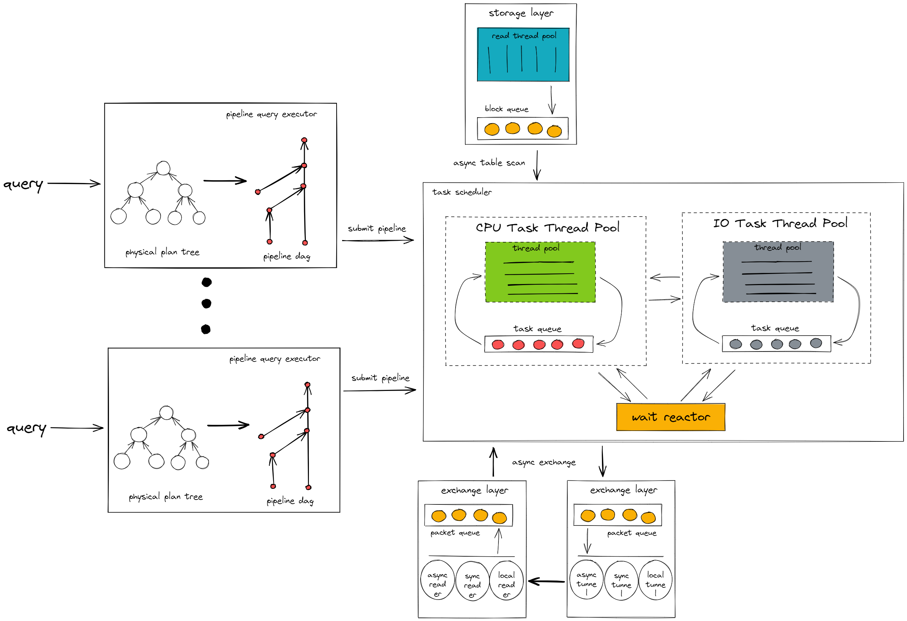
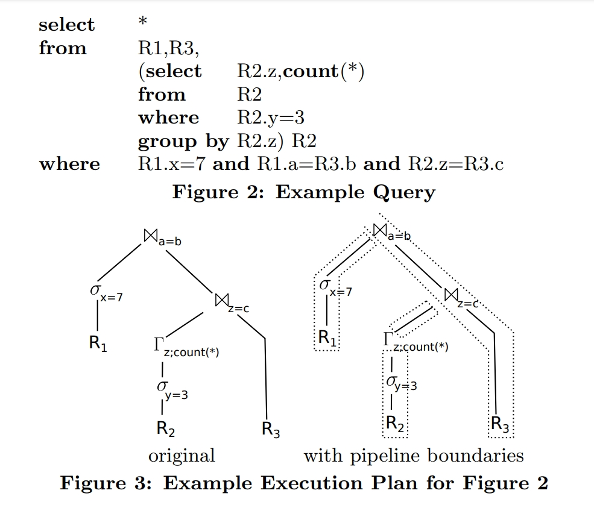

# TiFlash pipeline model design doc

* Author(s): [SeaRise](https://github.com/SeaRise), [ywqzzy](https://github.com/ywqzzy)
* Tracking Issue: <https://github.com/pingcap/tiflash/issues/6518>

## Table of Contents

* [Motivation or Background](#motivation-or-background)
* [Detailed Design](#detailed-design)
* [Impacts & Risks](#impacts-risks)

## Motivation or Background

Currently, TiFlash's parallel execution model is a thread scheduling execution model, where each query will independently apply for several threads to perform collaborative execution.
The thread scheduling model has two drawbacks: 
- In high-concurrency scenarios, too many threads are spawned which will cause many context switches and incur high thread scheduling costs for OS. When the number of threads reaches a certain number, the application of threads will report an error `thread constructor failed: Resource temporarily unavailable`. 
- The current thread scheduling model can‘t measures the resource usage of the query or perform fine-grained resource control.

Although TiFlash has introduced several features to reduce the impact of high concurrency on the thread scheduling model, such as `DynamicThreadPool`, `Async GRPC`, and `MinTsoScheduler`, we can still improve the existing parallel execution model to better adapt to high-concurrency scenarios and support future resource control functionalities.

By referring to [Morsel-Driven Parallelism: A NUMA-Aware Query Evaluation Framework for the Many-Core Age](https://15721.courses.cs.cmu.edu/spring2016/papers/p743-leis.pdf), we introduce a new concurrent execution model `pipeline model` and use a more efficient task scheduling mechanism.

## Detailed Design



### Generate pipeline dag

The plan tree sent to the query is divided into several pipelines according to the pipeline breaker and then assembled into a directed acyclic graph based on the dependency relationship.
- Pipeline: Most operators are compute-intensive and non-blocking, meaning that they immediately pass the computed data block to the next operator after processing the incoming data block. A chain of such operators is called a pipeline. In the pipeline calculation process, the data block can be kept in the cache as much as possible, which is very beneficial to temporal locality.
- Pipeline breaker: Some operators have blocking logic. For example, Aggregation writes all the data from the upstream operator to a hashmap before calculating the aggregate result from the hashmap and returning it to the downstream operator. Such operator breaks the pipeline called a pipeline breaker. However, pipeline breaker operators can be split into two non-blocking operators. For example, Aggregation can be split into AggregationBuild and AggregationConvergent, where the former is responsible for building a hashmap and the latter is responsible for aggregating the calculation result from the hashmap.

As shown in the following diagram:

For more details, please refer to [Efficiently Compiling Efficient Query Plans for Modern Hardware](https://www.vldb.org/pvldb/vol4/p539-neumann.pdf).

After the query is split into a pipeline dag, it will be submitted to the task scheduler for execution in sequence according to the DAG relationship.
The pipeline DAG is transformed into an event DAG where the dependencies between events correspond to the dependencies between pipelines.
Source events, i.e. events without upstream dependencies, are submitted directly to the task scheduler for execution.
After an event is completed, downstream events are triggered for execution.
An event is only submitted to the task scheduler for execution when all its upstream dependencies have completed.
```
             generate                submit              |
pipeline dag ────────►  event1 ────────────────────────► |
                                                         |
                          │  completed and then trigger  |
                          ▼                              |
                                     submit              |
                        event2 ────────────────────────► | task scheduler
                                                         |
                          │  completed and then trigger  |
                          ▼                              |
                                     submit              |
                        event3 ────────────────────────► |
```

### Schedule and execute task

The pipeline will be instantiated into several tasks according to the query concurrency and then executed in fixed-sized thread pools.
```
┌────────────────────────────┐
│      task scheduler        │
│                            │
│    ┌───────────────────┐   │
│ ┌──┤io task thread pool◄─┐ │
│ │  └──────▲──┬─────────┘ │ │
│ │         │  │           │ │
│ │ ┌───────┴──▼─────────┐ │ │
│ │ │cpu task thread pool│ │ │
│ │ └───────▲──┬─────────┘ │ │
│ │         │  │           │ │
│ │    ┌────┴──▼────┐      │ │
│ └────►wait reactor├──────┘ │
│      └────────────┘        │
│                            │
└────────────────────────────┘
```
The task will dynamically switch the component in the task scheduler where it is executed on based on the different execution logic.

#### CPU Task Thread Pool

CPU Task Thread Pool performs CPU-intensive calculation logic in operators, such as executing filters, projections, join probes, etc. Usually, most of the logic in an operator is CPU-intensive.

#### IO Task Thread Pool

IO Task Thread Pool performs IO-intensive calculation logic in operators, such as executing spill, restore, read from storage, etc.

#### Wait Reactor

Wait Reactor executes the waiting logic in operators, such as 
- Exchange receiver/sender waiting for network layer packet transmission and reception
- Waiting for storage read thread to pass blocks to the computing layer

## Impacts & Risks

Currently, the pipeline model does not support disk-based join and disaggregated mode with S3.
