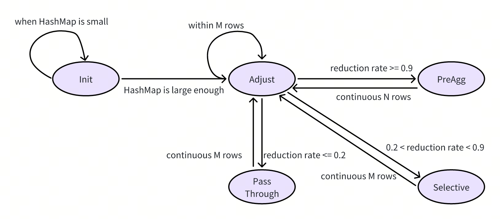

# AutoPassThroughHashAgg Design Doc

- Author(s): [guo-shaoge](http://github.com/guo-shaoge)
- Tracking Issue: https://github.com/pingcap/tiflash/issues/9196

## Table of Contents

* [Introduction](#introduction)
* [Detailed Design](#detailed-design)
* [Impacts & Risks](#impacts--risks)
* [Unresolved Questions](#unresolved-questions)

## Introduction
The HashAgg pushed down to TiFlash can be a one-stage, two-stage, or three-stage. For two-stage and three-stage aggregations, the 1st hashagg is used for pre-aggregation to reduce the amount of data that needs to be shuffled.

However, the optimizer cannot always choose the most suitable plan based on statistics. For example, it is common to encounter cases where two-stage HashAgg is used for datasets with high NDV, resulting in poor pre-aggregation effects in the 1st hashagg.

Therefore, `AutoPassThroughHashAgg` is proposed as an adaptive HashAgg that dynamically determines at runtime whether the 1st hashagg needs to perform pre-aggregation or not.

## Detailed Design
### Core State Switch
The 1st hashagg will follow the state transition diagram below, with each state having the following meanings:
1. `Init`: The initial state, where it remains as long as the HashMap is smaller than a specific value(to make sure the HashMap can fit in the L2 cache). In this state, the incoming Block is inserted into the HashMap for pre-aggregation.
2. `Adjust`: In this state, the Block is inserted into the HashMap while probing and recording the degree of aggregation for the Block. It will switch to `PreAgg` or `PassThrough`.
3. `PreAgg`: In this state, the Block is inserted into the HashMap. This state lasts for N rows(see code for N) before switching back to the `Adjust` state.
4. `PassThrough`: In this state, the Block is directly put into the memory buffer. This state lasts for M rows(see code for M) before switching back to the `Adjust` state.
5. `Selective`: For rows which can hit the HashMap, the aggregation function is calculated directly. For rows can't hit, they are put into the pass through buffer. So in this state, the HashMap does not grow.

All the above logic will be encapsulated within the `AutoPassThroughHashAggContext` class, which will be called by the executor related class.

The `AutoPassThroughHashHelper` is responsible for helping generate the Columns of the corresponding aggregation functions in the pass-through Block. For certain specific aggregation functions, it's optimized to avoid iterating all rows.

### Executor
Two new classes will be added: `AutoPassThroughTransformOp` and `AutoPassThroughBlockInputStream`. They will construct the `AutoPassThroughHashAggContext` and call its methods to process the child Block.

It is worth noting that their thread model is similar to `fine grained shuffle`, meaning that each thread will handle its own data without performing final merge operations. Additionally, the Block in the pass-through buffer can be returned early, without having to wait for all data to be aggregated before sending out.

### DAGResponseWriter
In addition to the above modifications, the ExchangeSender logic needs to be adjusted. Due to the presence of the `Selective` state, some rows in a Block are inserted into the HashMap, while others need to be sent directly.

This functionality is accomplished through the `Block.info.selective` array. The DAGResponseWriter will use this array to determine which rows in a Block can be sent directly and which need to be ignored.

### Spill
If AutoPassThroughHashAgg is used, spilling will not occur. Once the HashMap grows large enough to require spilling, it will immediately trigger a forced pass-through(meaning all subsequent Blocks will be forced to pass through).

Additionally, the HashMap's Blocks will be prioritized for returning to the parent operator in order to quickly reduce memory pressure.

## Impacts & Risks
Since the algorithm judges the NDV of the overall dataset based on a small amount of data, it may lead to incorrect NDV estimation for some datasets, resulting in performance regression. In the future, this issue can be mitigated by introducing algorithms like LogLogCounting.

## Unresolved Questions
None
